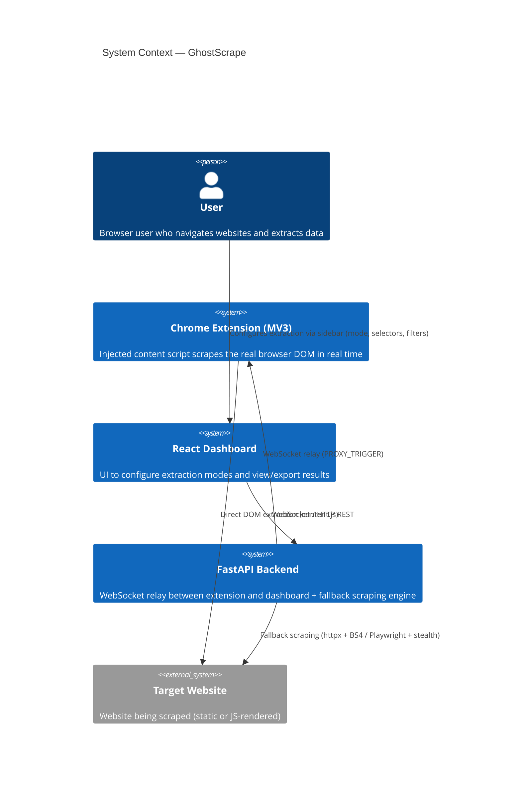
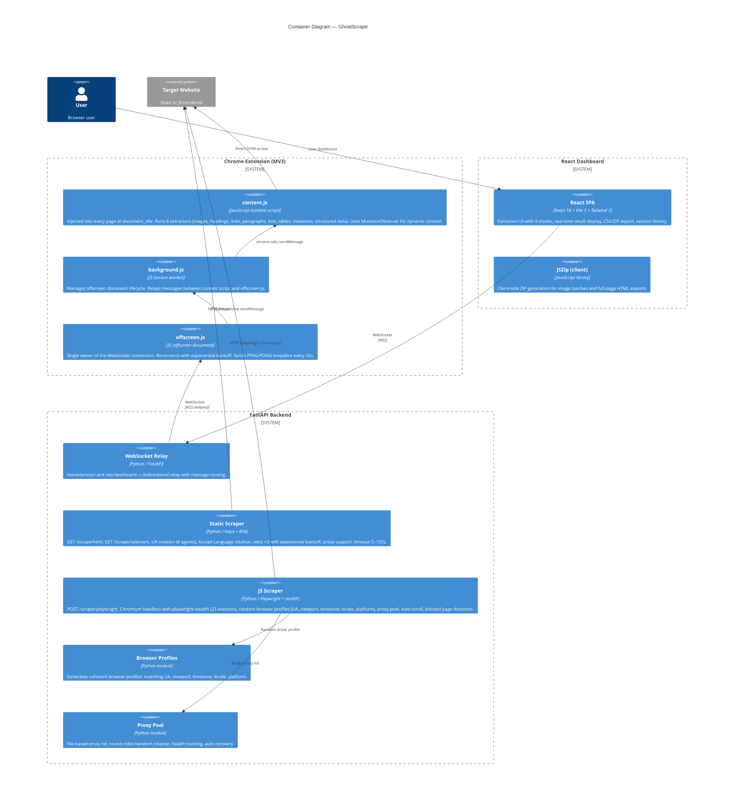
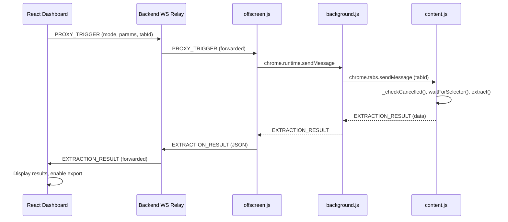
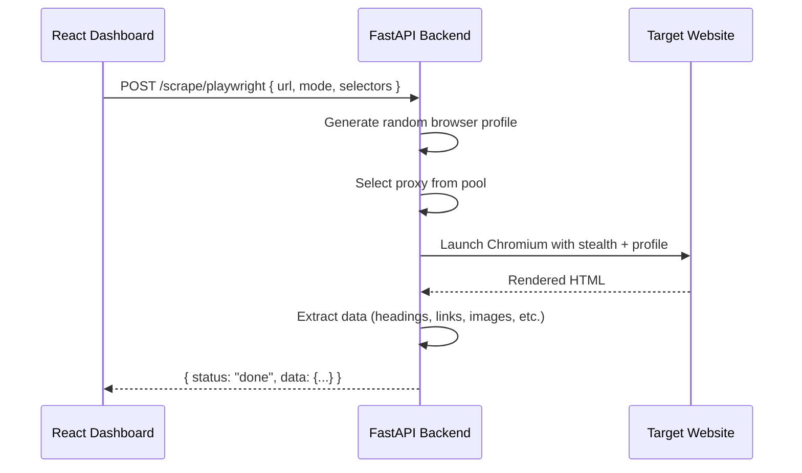
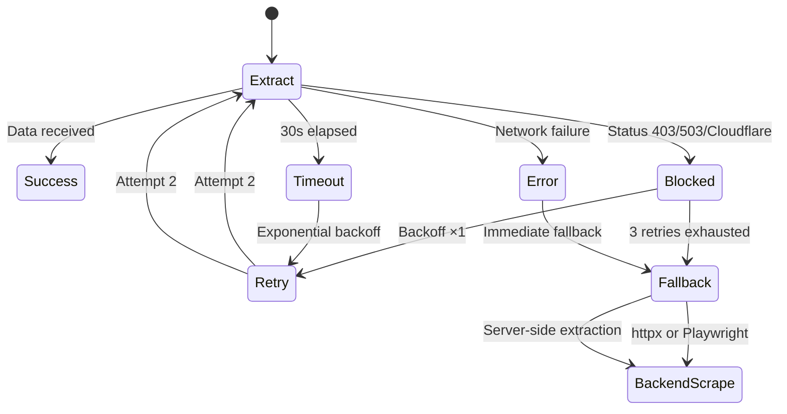

# GhostScrape Architecture

## 1. System Context (C4 Level 1)



**How it works:**
1. The user navigates to any website in Chrome — the extension's `content.js` is injected automatically at `document_idle`.
2. From the dashboard, the user selects an extraction mode (FullPage, DataTypes, CSS Selector) and clicks extract.
3. The dashboard sends the command via WebSocket to the backend, which relays it to the extension.
4. The extension executes extraction directly in the user's browser DOM and returns results.
5. If the extension is blocked (CSP, bot detection, Cloudflare), the backend falls back to server-side scraping.

---

## 2. Container Diagram (C4 Level 2)



---

## 3. Deployment Diagram

```mermaid
graph TB
  subgraph "User Machine (Chrome)"
    EXT["Chrome Extension MV3<br/>content.js + background.js + offscreen.js"]
  end

  subgraph "Server (Docker / VPS)"
    direction TB
    BE["FastAPI Backend<br/>uvicorn :8000"]

    subgraph "Scraping Engines"
      STATIC["httpx + BeautifulSoup<br/>Static HTML"]
      PLAYWRIGHT["Playwright + Stealth<br/>JS-rendered pages<br/>Chromium headless"]
    end

    subgraph "Modules"
      PROF["Profile Generator<br/>UA / Viewport / Timezone"]
      PROXY["Proxy Pool<br/>health tracking"]
    end

    PLAYWRIGHT --- PROF
    PLAYWRIGHT --- PROXY
    BE --- STATIC
    BE --- PLAYWRIGHT
  end

  subgraph "Static Hosting (Vercel / Nginx / Docker)"
    FE["React Dashboard<br/>Vite build → static files<br/>or Nginx serving :3000"]
  end

  EXT -- "WebSocket (relay)" --> BE
  FE -- "WebSocket / HTTP" --> BE
  BE -- "http / https" --> TARGET["Target Website"]
  EXT -- "Direct DOM" --> TARGET
  STATIC -- "http / https" --> TARGET
  PLAYWRIGHT -- "http / https (via proxy)" --> TARGET

  style EXT fill:#e1f5fe
  style FE fill:#fff3e0
  style BE fill:#e8f5e9
  style STATIC fill:#c8e6c9
  style PLAYWRIGHT fill:#c8e6c9
  style TARGET fill:#ffccbc
```



### Deployment Options

| Component | Option 1 (Simple) | Option 2 (Production) |
|---|---|---|
| **Backend** | Docker container with `mcr.microsoft.com/playwright` | Same + Nginx reverse proxy with TLS |
| **Frontend** | `npm run build` → served by Nginx in Docker | Vercel / Netlify (free) |
| **Extension** | Load unpacked (`chrome://extensions`) | Chrome Web Store ($5 developer account) |
| **Database** | None (localStorage only) | None |

### Docker Setup

```yaml
# docker-compose.yml (actuel — cf. racine du projet)
services:
  backend:
    build: .
    ports:
      - "8000:8000"
    volumes:
      - ./backend/proxies.txt:/app/proxies.txt
    restart: unless-stopped
    healthcheck:
      test: ["CMD", "curl", "-f", "http://localhost:8000/health"]
      interval: 30s
      timeout: 5s
      retries: 3
      start_period: 15s

  frontend-builder:
    image: node:20-alpine
    profiles:
      - build
    working_dir: /app
    volumes:
      - ./frontend:/app
    command: sh -c "npm install && npm run build"

  frontend:
    image: nginx:alpine
    ports:
      - "3000:80"
    volumes:
      - ./nginx/default.conf:/etc/nginx/conf.d/default.conf
      - ./frontend/dist:/usr/share/nginx/html
    depends_on:
      - backend
    restart: unless-stopped
```

---

## 4. Data Flow

### 4.1 Normal Path (Extension-based extraction)



### 4.2 Fallback Path (Backend scraping)



### 4.3 Error & Retry Flow



---

## 5. Anti-Blocking Strategy

The system employs multiple layers of anti-detection, depending on which scraping engine is used:

| Technique | Extension (content.js) | Backend (httpx) | Backend (Playwright) |
|---|---|---|---|
| **Retry with exponential backoff** | ✅ ×3 (1s, 2s, 4s) | ✅ ×3 (1s, 2s, 4s) | ✅ ×3 |
| **Timeout wrapper (30s)** | ✅ | ✅ (configurable 5–120s) | ✅ (30s) |
| **Blocked page detection** | ✅ Status code + content patterns | ✅ Status code + content patterns | ✅ Status code + content patterns |
| **UA rotation** | — (uses real browser UA) | ✅ 8 UAs rotated | ✅ Random per session |
| **Accept-Language rotation** | — | ✅ 4 locales | ✅ From profile |
| **Proxy pool** | — | ✅ (optional header) | ✅ Round-robin + health |
| **Random browser profile** | — | — | ✅ UA, viewport, timezone, locale, platform |
| **Stealth evasions** | — | — | ✅ playwright-stealth (23 patches) |
| **Auto-scroll** | — | — | ✅ Infinite scroll trigger |
| **CANCEL_EXTRACTION** | ✅ via _checkCancelled() | — | ✅ Cancellation token |

### Retry Logic (content.js)

```javascript
const retryManager = new RetryManager({
  maxRetries: 3,
  baseDelay: 1000,
  maxDelay: 4000,
  retryCondition: (error) => {
    if (error.name === 'AbortError') return false;
    if (error.message?.includes('timeout')) return true;
    return !error.message?.includes('404');
  }
});
```

### Profile Randomization (Playwright)

```python
def random_profile():
    desktop = random.choice(DESKTOP_UA_TEMPLATES)
    return {
        "user_agent": desktop["ua"],
        "viewport": desktop["viewport"],
        "timezone": desktop["timezone"],
        "locale": desktop["locale"],
        "platform": desktop["platform"]
    }
```

---

## 6. Technology Stack

| Layer | Technology | Version | Purpose |
|---|---|---|---|
| **Extension** | Manifest V3 | — | Chrome extension architecture |
| | JavaScript (ES2020) | — | Content script, service worker, offscreen |
| **Backend** | Python | 3.12 | Runtime |
| | FastAPI | 0.115.6 | REST + WebSocket framework |
| | Uvicorn | 0.34.0 | ASGI server |
| | httpx | 0.28.1 | HTTP client (static scraping) |
| | BeautifulSoup 4 | 4.12.3 | HTML parser (static scraping) |
| | lxml | 5.3.0 | XML/HTML parser |
| | Playwright | 1.49.1 | Headless Chromium (JS scraping) |
| | playwright-stealth | 1.0.6 | Anti-detection (23 evasions) |
| | orjson | 3.10.12 | Fast JSON serialization |
| | Pydantic | 2.10.4 | Request/response validation |
| **Frontend** | React | 18.3.1 | UI framework |
| | Vite | 5.4.11 | Build tool + dev server |
| | Tailwind CSS | 3.4.17 | Styling |
| | Vitest | 4.1.9 | Unit testing |
| | JSZip | 3.10.1 | Client-side ZIP export |
| **Infrastructure** | Docker | — | Containerization |
| | mcr.microsoft.com/playwright/python | v1.49.1 | Base image with Chromium + Python 3.12 |

---

## 7. Project Structure

```
GhostScrape/
├── backend/                       # Python / FastAPI API
│   ├── app/
│   │   ├── __init__.py
│   │   ├── main.py                # FastAPI entrypoint (CORS, /health, WS mount)
│   │   ├── api/
│   │   │   ├── __init__.py
│   │   │   ├── endpoint_ws.py     # WebSocket relay: /ws/extension, /ws/dashboard
│   │   │   ├── endpoint_scrape.py # REST static scraping: GET /scrape/html, /scrape/selectors
│   │   │   └── endpoint_playwright.py  # REST JS scraping: POST /scrape/playwright
│   │   └── scraper/
│   │       ├── __init__.py
│   │       ├── profile.py         # Random browser profile generator
│   │       └── proxy_pool.py      # Proxy pool with health tracking & rotation
│   ├── tests/
│   │   ├── __init__.py
│   │   ├── conftest.py
│   │   └── test_websocket.py
│   ├── proxies.txt                # Example proxy list (user-editable)
│   ├── requirements.txt           # Python dependencies
│   └── .env.example               # Environment template
│
├── extension/                     # Chrome Extension (MV3)
│   ├── manifest.json
│   ├── background.js              # Service worker — manages offscreen lifecycle
│   ├── content.js                 # Content script — injected DOM extractors
│   ├── offscreen.html             # Offscreen document page
│   ├── offscreen.js               # WebSocket owner (keepalive, reconnect)
│   ├── popup.html / popup.js      # Quick-action popup UI
│   ├── icons/                     # Extension icons (16, 48, 128 px)
│   └── test/                      # Manual HTML test pages
│       ├── extractImages.test.html
│       └── resolveUrl.test.html
│
├── frontend/                      # React Dashboard
│   ├── src/
│   │   ├── main.jsx               # Entry point
│   │   ├── App.jsx                # Root component
│   │   ├── index.css              # Tailwind imports
│   │   ├── components/
│   │   │   ├── layout/Sidebar.jsx # Mode selection, launch/cancel buttons
│   │   │   ├── modes/
│   │   │   │   ├── ModeCard.jsx       # Generic mode card
│   │   │   │   ├── FullPagePanel.jsx  # Full-page extraction controls
│   │   │   │   ├── DataTypePanel.jsx  # Data type filter controls
│   │   │   │   └── CssSelectorPanel.jsx # Custom CSS selector input
│   │   │   ├── preview/
│   │   │   │   ├── DetailView.jsx     # Single extraction detail
│   │   │   │   └── HistoryView.jsx    # Session history browser
│   │   │   ├── ConnectionStatus.jsx   # WebSocket connection indicator
│   │   │   └── ExtensionGuide.jsx     # Getting started guide
│   │   ├── hooks/
│   │   │   ├── useExtension.js        # WebSocket message send/receive
│   │   │   ├── useModeEngine.js       # Extraction state machine
│   │   │   └── useSessionHistory.js   # localStorage session persistence
│   │   ├── services/
│   │   │   ├── messageRouter.js       # WebSocket message routing
│   │   │   ├── modeRegistry.js        # Extraction mode definitions
│   │   │   ├── downloadCsv.js         # CSV export (data tables)
│   │   │   ├── downloadScrape.js      # ZIP export (full pages, images)
│   │   │   ├── downloadDataTypes.js   # Filtered data export
│   │   │   └── downloadCssSelector.js # CSS selector export
│   │   └── __tests__/
│   │       ├── downloadCsv.test.js
│   │       ├── messageRouter.test.js
│   │       └── modeRegistry.test.js
│   ├── tailwind.config.js
│   ├── vite.config.js
│   ├── index.html
│   └── package.json
│
├── .dockerignore                  # Build context Docker (excludes node_modules, venv, etc.)
├── Dockerfile                     # Image Docker (mcr.microsoft.com/playwright/python:v1.49.1)
├── docker-compose.yml             # Orchestration Docker (backend + frontend Nginx + frontend-builder)
├── nginx/
│   └── default.conf               # Proxy Nginx (API + WebSocket → backend, DNS resolver)
├── scripts/
│   └── generate-pdf.js            # PDF generation via Puppeteer
│
├── setup.ps1                      # Automated install script (Windows PowerShell)
├── setup.sh                       # Automated install script (Unix bash)
├── start-dev.ps1                  # Dev server launcher (Windows)
├── run.sh                         # Dev server launcher (Unix)
├── Makefile                       # Build/dev automation (cross-platform, Linux/macOS + Windows)
├── ARCHITECTURE.md                # This file
├── CAHIER_DES_CHARGES.pdf         # Full specification (French, 7 parts, 14 diagrams)
├── README.md                      # Project overview & quick start
└── .gitignore
```

---

## 8. Key Design Decisions

| Decision | Rationale |
|---|---|
| **No database** | All data lives in `localStorage` (frontend). User data never leaves the machine. No server-side storage costs. |
| **Extension-first scraping** | Scraping in the user's real browser avoids all headless detection. The backend is a fallback, not the primary engine. |
| **Playwright + httpx dual engine** | httpx handles simple sites (fast, lightweight). Playwright handles JS-rendered sites, SPAs, and sites with bot protection. |
| **playwright-stealth** | 23 evasions out of the box, maintained by the community. Better than building manual patches for each Chrome update. |
| **WebSocket relay pattern** | The extension can't connect directly to the dashboard (MV3 restrictions). The backend relays messages between them. |
| **Offscreen document** | MV3 limits service worker lifetime. The offscreen document owns the WebSocket connection and keeps it alive. |
| **Random browser profiles** | Sites fingerprint by UA + viewport + timezone + locale. Randomizing all 4 prevents correlation across sessions. |
| **Compressed session history** | `localStorage` has a 5–10 MB quota. Stripping `html`, `attrs`, large strings, and long arrays prevents data loss. |
| **Docker as primary deployment** | Docker encapsulates Python 3.12 + Node.js + Chromium + Playwright. Single command `docker compose up -d` works on Windows, macOS, and Linux with zero local dependencies. |
| **Cross-platform setup scripts** | `setup.ps1` (PowerShell) + `setup.sh` (bash) + `Makefile` provide consistent installation on all 3 OS without Docker. All paths use Unix separators; `Makefile` auto-detects Windows via `$(OS)` variable. |

---

## 9. Related Documents

- **[CAHIER_DES_CHARGES.pdf](./CAHIER_DES_CHARGES.pdf)** — Full project specification in French (28 sections, 14 C4/activity diagrams)
- **[README.md](./README.md)** — Quick start guide, installation, and usage
- **Extension source**: `extension/content.js` — core extraction logic
- **Backend source**: `backend/app/api/endpoint_playwright.py` — Playwright scraping engine
