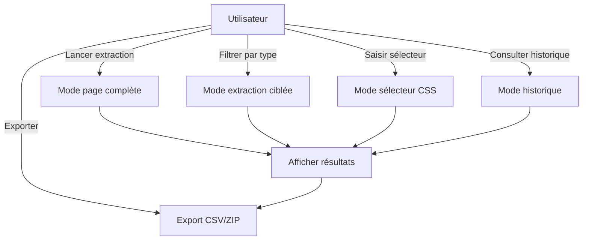
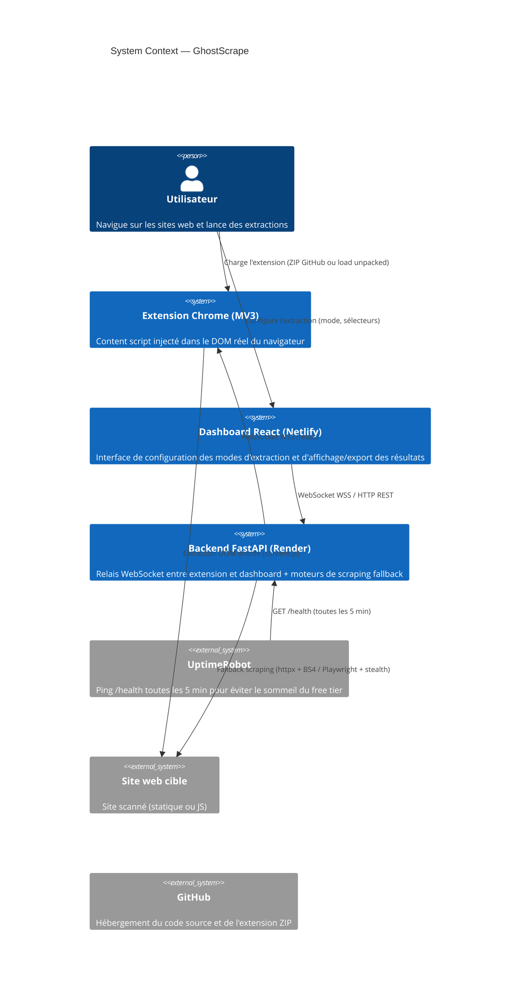
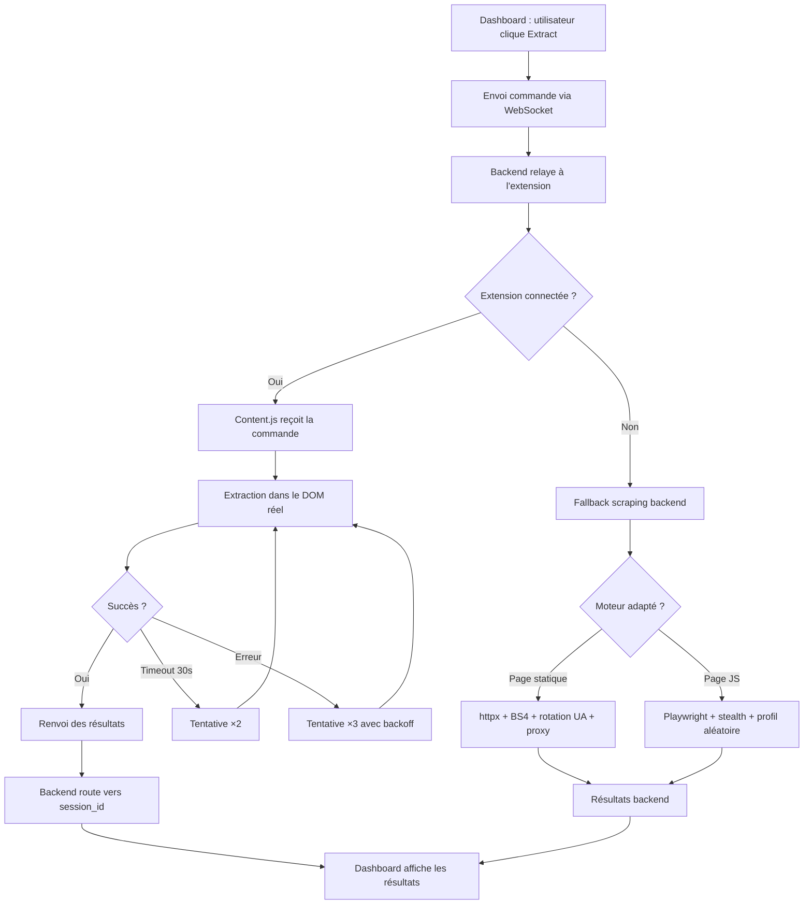

# GhostScrape — Cahier des Charges

**Version :** 1.0
**Date :** juillet 2026
**Statut :** Version finale
**Dépôt :** https://github.com/Prosper-BATAMBA/Ghostscrape.git

## Table des matières

- [1. Introduction](#1-introduction)
  - [1.1 Résumé exécutif](#11-résumé-exécutif)
  - [1.2 Contexte](#12-contexte)
  - [1.3 Problématique](#13-problématique)
  - [1.4 Objectifs](#14-objectifs)
- [2. Analyse du besoin](#2-analyse-du-besoin)
  - [2.1 Public cible](#21-public-cible)
  - [2.2 User stories](#22-user-stories)
- [3. Présentation de la solution](#3-présentation-de-la-solution)
  - [3.1 Vision](#31-vision)
  - [3.2 Principe de fonctionnement](#32-principe-de-fonctionnement)
- [4. Spécifications Fonctionnelles](#4-spécifications-fonctionnelles)
  - [4.1 Cas d'utilisation](#41-cas-dutilisation)
  - [4.2 Fonctionnalités](#42-fonctionnalités)
  - [4.3 Exigences non fonctionnelles](#43-exigences-non-fonctionnelles)
- [5. Architecture Technique](#5-architecture-technique)
  - [5.1 Architecture globale C4 Context](#51-architecture-globale-c4-context)
  - [5.2 Stack technique](#52-stack-technique)
  - [5.3 Diagrammes](#53-diagrammes)
  - [5.4 Modèles de données](#54-modèles-de-données)
  - [5.5 Sécurité](#55-sécurité)
  - [5.6 Gestion des erreurs](#56-gestion-des-erreurs)
- [6. Interface et maquettes](#6-interface-et-maquettes)
  - [6.1 Interface d'accueil](#61-interface-daccueil)
  - [6.2 Visuel popup](#62-visuel-popup)
  - [6.3 Contraintes techniques et risques](#63-contraintes-techniques-et-risques)
- [7. Matrice des risques](#7-matrice-des-risques)

## 1. Introduction

### 1.1 Résumé exécutif

GhostScrape est une plateforme de web scraping locale, gratuite et open source permettant d'extraire des données structurées depuis des pages web sans écrire de code. L'application repose sur une extension Chrome, un backend FastAPI hébergé (stateless) et un tableau de bord React communiquant en temps réel via WebSocket. Elle vise à simplifier la collecte de données pour les utilisateurs non techniques tout en garantissant la confidentialité des informations grâce à un traitement sur le poste client : les données extraites ne sont jamais persistées sur le backend — elles transitent en mémoire vive le temps de la session et sont immédiatement relayées au dashboard.

### 1.2 Contexte

Avec la croissance du volume de données disponibles sur le Web, la collecte automatisée d'informations est devenue une activité essentielle dans de nombreux domaines tels que la data science, le référencement (SEO), la veille concurrentielle, la recherche académique, le journalisme de données ou encore l'analyse marketing.

Aujourd'hui, deux grandes approches dominent le web scraping :

- La première repose sur des bibliothèques de programmation telles que BeautifulSoup, Scrapy, Selenium, Puppeteer ou Playwright. Bien que puissantes, ces solutions nécessitent des compétences en programmation et le développement de scripts spécifiques pour chaque site à analyser.
- La seconde est constituée de plateformes SaaS proposant des interfaces graphiques facilitant l'extraction des données. Malgré leur simplicité d'utilisation, ces solutions impliquent généralement des coûts d'abonnement, des limitations d'utilisation ainsi que le traitement des données sur des infrastructures distantes, ce qui peut poser des questions de confidentialité.

Dans ce contexte, il existe un besoin pour une solution permettant d'effectuer des extractions de données de manière visuelle, locale, gratuite et sans compétences avancées en développement.

### 1.3 Problématique

Comment permettre à des utilisateurs ne disposant pas de compétences en programmation d'extraire rapidement des données structurées depuis des pages web, tout en garantissant la confidentialité des données, en supprimant les coûts liés aux plateformes cloud et en offrant une interface simple permettant d'obtenir des résultats directement exploitables ?

Pour répondre à cette problématique, le projet GhostScrape propose une plateforme de web scraping combinant une extension Chrome (locale), un backend FastAPI hébergé (relais stateless) et un tableau de bord React afin d'offrir une expérience d'extraction visuelle, rapide et sans écriture de code.

### 1.4 Objectifs

#### 1.4.1 Objectif principal

Concevoir une plateforme de web scraping permettant d'extraire des données structurées depuis des pages web sans programmation, avec une extension locale et un backend relayé hébergé (stateless — les données ne sont jamais persistées sur le serveur).

#### 1.4.2 Objectifs spécifiques

- Réduire le temps nécessaire à la collecte de données web.
- Rendre le web scraping accessible aux utilisateurs non techniques.
- Garantir la confidentialité des données : l'extension scrappe le DOM réel du navigateur, les données transitent par le backend sans être persistées.
- Permettre l'extraction de plusieurs types de contenus (textes, images, liens, tableaux, métadonnées, etc.).
- Fournir des résultats directement exploitables grâce aux exports CSV et ZIP.
- Assurer une communication temps réel entre les différents composants de l'application via WebSocket.
- Concevoir une architecture modulaire facilitant les évolutions futures.

## 2. Analyse du besoin

### 2.1 Public cible

GhostScrape s'adresse aux utilisateurs ayant besoin d'extraire des données depuis des pages web de manière simple, rapide et locale, sans développer de scripts spécifiques. L'application vise aussi bien les professionnels que les étudiants ou les particuliers manipulant régulièrement des informations issues du Web.

Les principaux utilisateurs ciblés sont les suivants :

#### 2.1.1 Analystes de données

Les analystes de données utilisent GhostScrape pour collecter rapidement des jeux de données provenant de sites web afin de les exploiter dans des outils tels qu'Excel, Power BI, Python ou R. L'application leur permet de constituer des datasets sans avoir à écrire de scripts de scraping.

#### 2.1.2 Professionnels du référencement (SEO)

Les spécialistes du référencement peuvent extraire les titres, métadonnées, liens, images ou structures HTML d'un site afin de réaliser des audits SEO, des analyses concurrentielles ou des études de contenu.

#### 2.1.3 Développeurs web

Les développeurs utilisent GhostScrape pour tester rapidement des sélecteurs CSS, inspecter la structure du DOM, récupérer des éléments HTML ou générer des jeux de données destinés à leurs applications.

#### 2.1.4 Designers UX/UI

Les designers peuvent récupérer facilement des images, des éléments graphiques ou des exemples d'interfaces provenant de sites web afin de constituer une base d'inspiration ou d'analyser les tendances de conception.

#### 2.1.5 Chercheurs et étudiants

Les étudiants et les chercheurs peuvent automatiser la collecte de données publiques nécessaires à leurs travaux académiques, mémoires ou projets de recherche, sans disposer de compétences avancées en programmation.

#### 2.1.6 Journalistes et analystes

Les journalistes de données, consultants et analystes peuvent utiliser GhostScrape pour extraire rapidement des informations publiques destinées à des études, des rapports ou des travaux de veille.

### 2.2 User stories

#### 2.2.1 Analyste de données

- Je veux exporter les données extraites au format CSV afin de les exploiter directement dans Excel ou Power BI.
- Je veux sélectionner uniquement les types de données à extraire afin de récupérer uniquement les informations utiles.
- Je veux prévisualiser les résultats avant l'export afin de vérifier la qualité des données collectées.
- Je veux retrouver mes extractions précédentes afin de réutiliser mes données sans recommencer l'extraction.
- Je veux connaître l'état de la connexion avec l'extension afin de savoir si une extraction peut être lancée.

#### 2.2.2 Développeur

- Je veux tester un sélecteur CSS afin de vérifier rapidement qu'il cible les bons éléments.
- Je veux extraire les éléments correspondant à un sélecteur personnalisé afin de récupérer une structure HTML spécifique.
- Je veux consulter les attributs HTML des éléments extraits afin de faciliter le débogage et l'inspection du DOM.
- Je veux obtenir les résultats dans un format exploitable par mes outils afin d'automatiser des traitements complémentaires.

#### 2.2.3 Designer UX/UI

- Je veux télécharger toutes les images d'une page afin de constituer une bibliothèque d'inspiration.
- Je veux récupérer les ressources visuelles en un seul export afin de gagner du temps lors de ma veille graphique.
- Je veux récupérer les ressources visuelles en un seul export afin de gagner du temps lors de ma veille graphique.

## 3. Présentation de la solution

### 3.1 Vision

> "Naviguez, sélectionnez, téléchargez."

GhostScrape a pour ambition de démocratiser le web scraping en proposant une solution gratuite, locale et intuitive permettant d'extraire des données structurées depuis des pages web sans écrire une seule ligne de code. L'application offre une interface visuelle simple tout en garantissant la confidentialité des données grâce à un traitement sur le poste client.

### 3.2 Principe de fonctionnement

GhostScrape fonctionne avec **quatre modes d'extraction** :

- **Mode page complète (FullPage)** : ce mode permet à l'utilisateur de scraper l'entièreté de la page en récupérant les principaux éléments (titres, liens, paragraphes, images).
- **Mode extraction ciblée (DataTypes)** : ce mode permet à l'utilisateur de sélectionner un type d'élément précis parmi ceux présents (images, titres, liens, paragraphes, listes, tableaux, métadonnées, données structurées).
- **Mode sélecteur CSS (CssSelector)** : permet de scraper la page selon une balise ou un sélecteur CSS saisi librement.
- **Mode historique (HistoryView)** : permet de consulter l'historique des 20 dernières sessions d'extraction avec reprise des résultats et ré-export.

Le flux de données suit ce chemin :

1. L'utilisateur navigue sur une page web dans Chrome — l'extension injecte automatiquement un content script.
2. Depuis le dashboard (Netlify), l'utilisateur choisit un mode et clique sur « Extract ».
3. La commande est envoyée via WebSocket (WSS) au backend (Render), qui la relaye à l'extension Chrome.
4. L'extension exécute l'extraction directement dans le DOM réel du navigateur et renvoie les résultats.
5. Le backend relaye les résultats uniquement au dashboard de la session concernée (isolation par session_id).
6. Le dashboard affiche les résultats et permet l'export (CSV ou ZIP).

## 4. Spécifications Fonctionnelles

### 4.1 Cas d'utilisation

### 4.2 Fonctionnalités

- Extraction page complète, éléments spécifiques, par sélecteur CSS et balises.
- Export ZIP (textes, liens, CSV, images).
- Consultation de l'historique des sessions (20 dernières, politique FIFO).
- Navigation depuis le dashboard vers une page cible.

### 4.3 Exigences non fonctionnelles

| Exigence | Description |
|---|---|
| Disponibilité | L'extension fonctionne en local ; le backend est hébergé sur Render (free tier, peut s'endormir après 15 min d'inactivité — UptimeRobot ping /health toutes les 5 min) |
| Performances extraction | Extraction full page (500 éléments) terminée en moins de 2 s |
| Performances reconnexion | Reconnexion WebSocket en moins de 5 s (worst case) |
| Volume de données | Export ZIP limité à 50 Mo (contrainte mémoire navigateur) |
| Historique | 20 sessions maximum en localStorage, politique FIFO |
| Accessibilité | Interface utilisable sans connaissance en programmation |
| Résilience | Reconnexion automatique de tous les composants en cas de perte de connexion |
| Isolation session | Chaque onglet du dashboard possède un session_id unique ; le backend route les messages vers la bonne session uniquement |

## 5. Architecture Technique

### 5.1 Architecture globale C4 Context

### 5.2 Stack technique

| Couche | Technologie | Version | Rôle |
|---|---|---|---|
| Extension | Chrome MV3 (Manifest V3) | — | Content script + service worker + offscreen document + popup |
| Frontend | React | 18.3.1 | Interface utilisateur (dashboard) |
| Bundler | Vite | 5.4.11 | Build et hot-reload en développement |
| CSS | Tailwind CSS | 3.4.17 | Styles utilitaires |
| Backend | Python / FastAPI | 3.12 / 0.115+ | Relais WebSocket + health check |
| Backend | BeautifulSoup / lxml | 4.12.3 / 5.3.0 | Parsing HTML (scraping statique) |
| Backend | Playwright | 1.49.1 | Scraping navigateur réel (JS, SPA) |
| Backend | playwright-stealth | 1.0.6 | Anti-détection (23 évasions) |
| Backend | httpx | 0.28.1 | Client HTTP (scraping statique) |
| Backend | orjson | 3.10.12 | JSON rapide |
| Backend | Pydantic | 2.10.4 | Validation des messages WebSocket |
| ZIP | JSZip | 3.10.1 | Génération d'archives ZIP côté client |
| Infrastructure | Docker | — | Conteneurisation du backend |
| Infrastructure | Nginx | — | Reverse proxy (DNS resolver pour Docker) |
| Infrastructure | Render | — | Hébergement backend (Docker) |
| Infrastructure | Netlify | — | Hébergement frontend (fichiers statiques) |
| Infrastructure | UptimeRobot | — | Keepalive backend (ping /health toutes les 5 min) |
| Infrastructure | GitHub | — | Code source + distribution extension ZIP |

### 5.3 Diagrammes

#### 5.3.1 Diagramme d'activité — Processus d'extraction

### 5.4 Modèles de données

#### 5.4.1 Principes

- **Aucune base de données côté serveur** : le backend est un relais stateless, il ne stocke aucune donnée. Les données extraites transitent en mémoire vive le temps de la session et sont immédiatement relayées au dashboard.
- **Validation côté backend** : via Pydantic (message WebSocket).
- **Persistance côté client** : localStorage pour l'historique des sessions, mémoire vive pour les résultats en cours.
- **Isolation par session** : chaque onglet du dashboard possède un session_id unique stocké en sessionStorage. Le backend route les messages uniquement vers la session concernée (pas de broadcast entre utilisateurs).

| Entité | Attributs principaux |
|---|---|
| Session d'extraction (ScrapeSession) | id, modeId, url, title, timestamp, data |
| Image (ImageResult) | src, alt, width, height, type, tag, html, attrs |
| Lien (LinkResult) | text, html, attrs, tag, href, resolvedUrl, isInternal |
| Titre (HeadingResult) | h1, h2, h3, h4, h5, h6 |
| Tableau (TableResult) | caption, headers, rows |
| Liste (ListResult) | type, items |
| Métadonnées (MetadataResult) | title, description, keywords, og, twitter |
| Données structurées (StructuredDataItem) | type, data, count, examples (contenant type et props [name, value]) |

L'absence de base de données est un choix délibéré :

- **Simplicité** : pas d'installation de PostgreSQL, Redis ou autre service.
- **Confidentialité** : aucune donnée persistée côté serveur = zéro risque de fuite.
- **Performance** : pas de latence réseau pour des requêtes DB.
- **Déploiement** : le backend se lance en une commande (`uvicorn`), aucune configuration requise.
- **Évolutivité** : si une persistance devient nécessaire (utilisateurs, authentification), une migration vers une base de données est possible sans refonte architecturale.

### 5.5 Sécurité

#### 5.5.1 Principes fondamentaux

- **Zéro donnée persistée** : aucune donnée extraite n'est stockée sur le backend — elle transite en mémoire vive et est immédiatement relayée au dashboard.
- **Zéro exécution de code utilisateur** : les sélecteurs CSS sont des chaînes, jamais exécutés comme code.
- **Zéro téléchargement automatique** : l'utilisateur clique toujours pour télécharger.
- **Sandbox MV3** : le content script est isolé de la page par Chrome.
- **WSS/TLS en production** : les communications WebSocket entre le dashboard, l'extension et le backend sont chiffrées (WSS).
- **Isolation des sessions** : chaque onglet du dashboard possède un session_id unique. Le backend ne relaye les résultats qu'à la session concernée.

#### 5.5.2 CORS

- Aucun mot de passe stocké.
- Aucun token, clé API ou secret.
- Aucune persistance backend (tout est in-memory ou localStorage).
- Le backend autorise les origines suivantes : `http://localhost:3000`, `https://ghostscrape-front.netlify.app`.

### 5.6 Gestion des erreurs

#### 5.6.1 Codes d'erreur

| Code | Signification | Cause | Action recommandée |
|---|---|---|---|
| GS001 | Extension absente | WebSocket déconnecté, extension non chargée | Attendre la reconnexion automatique |
| GS002 | Timeout extraction | Page trop lourde, sélecteur trop large | Réessayer ou réduire le périmètre |
| GS003 | WebSocket fermé | Backend arrêté ou réseau coupé | Relancer le backend / attendre le redéploiement Render |
| GS004 | Sélecteur invalide | CSS mal formé, sélecteur inexistant | Corriger le sélecteur et réessayer |
| GS005 | Image inaccessible | CORS bloque le fetch, URL 404, timeout | Ignorée silencieusement |
| GS006 | Backend en sommeil | Render free tier, 15 min d'inactivité | Ping /health, attendre 30-60s (cold start) |
| GS007 | Échec téléchargement | API File System Access non disponible | Fallback download automatique |
| GS008 | Session invalide | session_id manquant ou mismatch | Reconnecter le dashboard |

#### 5.6.2 Journalisation

Les logs utilisent le préfixe `[GS]` (GhostScrape) avec des suffixes par module :

| Préfixe | Module | Exemple |
|---|---|---|
| `[GS]` | content.js | `[GS] content script loaded — inline mode` |
| `[GS BG]` | background.js | `[GS BG] Mode activated: full-page` |
| `[GS Offscreen]` | offscreen.js | `[GS Offscreen] WS connected` |
| `[WS]` | backend endpoint_ws.py | `[WS] Dashboard connected (session=abc123)` |

## 6. Interface et maquettes

### 6.1 Interface d'accueil

*Interface d'accueil du dashboard GhostScrape — sidebar des modes, zone de résultats, indicateur de connexion.*

### 6.2 Visuel popup

*Popup de l'extension GhostScrape — accès rapide au dashboard et statut de la connexion.*

#### 6.2.1 Visuel Résultat extraction (mode page complète)

*Résultats d'une extraction en mode FullPage — titres, liens, paragraphes, images.*

#### 6.2.2 Interface mode ciblée

*Sélection du type de données à extraire (images, tableaux, métadonnées, données structurées).*

##### Résultat extraction (mode ciblé)

*Résultats filtrés par type de données.*

#### 6.2.3 Interface mode CSS

*Saisie d'un sélecteur CSS personnalisé avec test en direct.*

##### Résultats extraction (mode CSS)

*Résultats correspondant au sélecteur CSS saisi.*

### 6.3 Contraintes techniques et risques

#### 6.3.1 Contraintes techniques

| Contrainte | Détail |
|---|---|
| Manifest V3 | Pas de `eval()`, pas de `Function()`, pas de script distant |
| Offscreen API | Chrome ≥ 116, document caché pour WebSocket |
| WebSocket | Pas de WebSocket dans un service worker → offscreen obligatoire |
| Content script | Isolé du contexte de la page (sandbox MV3) |
| CORS | Les `fetch()` depuis content.js sont soumis aux CORS de la page |
| localStorage | Limité à ~5–10 Mo selon le navigateur |
| Service worker | Tué après ~30 s d'inactivité → keepalive nécessaire |
| Port Chrome | 1 seule connexion par port de message runtime |
| Render free tier | Backend s'endort après 15 min d'inactivité → première connexion WebSocket peut prendre 30-60s (cold start). UptimeRobot ping /health toutes les 5 min pour atténuer |

#### 6.3.2 Compatibilité navigateur

| Navigateur | Support | Raison |
|---|---|---|
| Google Chrome ≥ 116 | Complet | MV3, Offscreen API |
| Microsoft Edge ≥ 116 | Complet | Basé sur Chromium |
| Firefox | Non | MV3 non supporté |
| Safari | Non | Pas de MV3 |

#### 6.3.3 Dépendances externes

| Dépendance | Risque | Mesure |
|---|---|---|
| Chrome MV3 (offscreen API) | Google modifie ou supprime l'API | Surveiller ChromeStatus, planifier migration Playwright (V0.5) |
| React 18 | Fin de support | Migration vers React 19 (LTS suivante) |
| FastAPI / Pydantic | Breaking changes | Tests automatisés, CI GitHub |
| JSZip | Vulnérabilité | Mise à jour via npm audit |
| playwright-stealth | Incompatibilité avec nouvelle version Chrome | Suivre les releases, fallback httpx |
| Render free tier | Changement des conditions du free tier | Prévoir budget $7/mo pour plan Starter |

## 7. Matrice des risques

| Risque | Probabilité | Impact | Niveau | Atténuation |
|---|---|---|---|---|
| Google modifie les APIs MV3 (offscreen, service worker) | Forte | Élevé | Critique | Planifier migration Playwright comme moteur principal (V0.5) |
| Render free tier endort le backend après inactivité | Élevée | Moyen | Moyen | UptimeRobot ping /health toutes les 5 min ; ping /health par l'extension avant connexion WS |
| Session isolation cassée (broadcast des résultats à tous les dashboards) | Faible | Critique | Élevé | Routage par _session_id côté backend ; test unitaire dédié |
| playwright-stealth incompatible avec une mise à jour Chrome | Moyenne | Élevé | Élevé | Suivre les releases de playwright-stealth ; fallback httpx pour pages statiques |
| Extension ZIP corrompu ou fichier manquant | Faible | Élevé | Moyen | Tester manuellement après chaque mise à jour ; script de validation CI |
| Déploiement Netlify ou Render cassé | Faible | Élevé | Moyen | Vérifier l'état du déploiement avant de merge ; notification Slack/e-mail |
