# Cahier des Charges — GhostScrape

> **Version :** 1.0  
> **Date :** juillet 2026  
> **Statut :** Version finale  
> **Dépôt :** [github.com/anomalyco/ghostscrape](https://github.com/anomalyco/ghostscrape)

---

## Table des matières

### PARTIE I — Cadre du Projet
1. [Page de garde](#1-page-de-garde)
2. [Résumé exécutif](#2-résumé-exécutif)
3. [Contexte et problématique](#3-contexte-et-problématique)
4. [Objectifs métier](#4-objectifs-métier)
5. [Présentation de la solution](#5-présentation-de-la-solution)
6. [Public cible et personas](#6-public-cible-et-personas)

### PARTIE II — Spécifications Fonctionnelles
7. [Cas d'utilisation](#7-cas-dutilisation)
8. [Fonctionnalités](#8-fonctionnalités)
9. [Critères d'acceptation](#9-critères-dacceptation)
10. [Exigences non fonctionnelles](#10-exigences-non-fonctionnelles)

### PARTIE III — Architecture Technique
11. [Architecture globale — C4 Context](#11-architecture-globale--c4-context)
12. [Architecture technique — Stack et C4 Container](#12-architecture-technique--stack-et-c4-container)
13. [Flux de données et catalogue des messages](#13-flux-de-données-et-catalogue-des-messages)
14. [Modèles de données](#14-modèles-de-données)
15. [Protocoles et API](#15-protocoles-et-api)
16. [Gestion d'état et persistance](#16-gestion-détat-et-persistance)

### PARTIE IV — Exigences Transverses et Qualité
17. [Sécurité](#17-sécurité)
18. [Gestion des erreurs](#18-gestion-des-erreurs)
19. [Interface et maquettes](#19-interface-et-maquettes)
20. [Contraintes techniques et versions](#20-contraintes-techniques-et-versions)

### PARTIE V — Cycle de Vie et Déploiement
21. [Performances attendues](#21-performances-attendues)
22. [Stratégie de tests](#22-stratégie-de-tests)
23. [Déploiement](#23-déploiement)
24. [Maintenance et évolutions](#24-maintenance-et-évolutions)

### PARTIE VI — Pilotage et Risques
25. [Roadmap](#25-roadmap)
26. [Risques et atténuation](#26-risques-et-atténuation)

### PARTIE VII — Annexes
27. [Glossaire](#27-glossaire)
28. [Architecture Decision Records (ADR)](#28-architecture-decision-records-adr)

---

## Partie I — Cadre du Projet

---

### 1. Page de garde

| Champ | Valeur |
|---|---|
| **Nom du projet** | GhostScrape |
| **Nature** | Plateforme de web scraping visuel et local |
| **Version du document** | 1.0 |
| **Date** | juillet 2026 |
| **Auteur** | Équipe GhostScrape |
| **Dépôt** | [github.com/anomalyco/ghostscrape](https://github.com/anomalyco/ghostscrape) |
| **Licence** | Open source |
| **Composants livrés** | Extension Chrome MV3, backend FastAPI, dashboard React |

---

### 2. Résumé exécutif

#### Le problème

Le web scraping est aujourd'hui dominé par deux approches : les solutions **programmatiques** (BeautifulSoup, Scrapy, Puppeteer) qui exigent des compétences en développement, et les solutions **SaaS** (Octoparse, ParseHub, Apify) qui sont payantes, hébergent les données chez un tiers et limitent les volumes. Les analystes data, designers UX et autres professionnels non-techniciens n'ont pas d'outil gratuit, local et visuel pour collecter des données structurées depuis le web.

#### La solution

GhostScrape est une plateforme de web scraping **100 % locale, gratuite et visuelle** composée de trois parties :

- **Extension Chrome MV3** — injectée dans la page visitée, elle extrait le contenu du DOM en temps réel (titres, images, liens, tableaux, métadonnées, sélecteurs CSS personnalisés)
- **Backend Python FastAPI** — relais WebSocket entre l'extension et le dashboard
- **Dashboard React 18 + Vite 5 + Tailwind 3** — interface utilisateur pour lancer les extractions et exporter les résultats

L'utilisateur navigue sur une page web, sélectionne un mode d'extraction, récupère les données structurées et les exporte en CSV ou ZIP. **Aucune ligne de code n'est nécessaire.**

#### Impact business

| Indicateur | Avant GhostScrape | Après GhostScrape | Gain |
|---|---|---|---|
| Temps de collecte d'un dataset | 30–60 min (copier-coller manuel) | 2–5 min (3 clics) | **× 5 à 10** |
| Compétence requise | Développeur Python/JS | Utilisateur Excel | **0 code** |
| Coût d'infrastructure | Serveur cloud (SaaS) ou temps développeur | 0 € (local) | **Économie totale** |
| Format de livraison | Fichier brut à retraiter | CSV prêt pour Excel ou ZIP structuré | **Temps zéro** |

#### Budget et planning

- **Infrastructure :** 0 € (100 % local, zéro dépendance cloud)
- **Développement :** réalisé en itérations internes
- **Coût utilisateur :** gratuit et open source
- **Livré :** V0.1 à V0.3 terminées (3 modes d'extraction, exports CSV/ZIP, images, historique)
- **En cours :** V0.4 (performances), V0.5 (automatisation headless), V0.6 (multi-navigateur)

#### Architecture en une phrase

```
Extension Chrome MV3 ←→ Backend FastAPI ←→ Dashboard React (3 composants, 2 WebSockets, 0 base de données, 0 cloud)
```

---

### 3. Contexte et problématique

#### 3.1 État de l'art

Le marché du web scraping se divise en deux catégories principales :

| Approche | Exemples | Limites |
|---|---|---|
| **Programmatique** | Python (BeautifulSoup, Scrapy, Selenium), Node.js (Puppeteer, Playwright) | Nécessite des compétences techniques solides. Chaque nouveau site nécessite un script dédié. |
| **SaaS / Cloud** | Octoparse, ParseHub, Apify, ScrapingBee | Payant (abonnement mensuel). Données hébergées chez un tiers. Limitations de volume. Dépendance réseau. |

#### 3.2 Positionnement de GhostScrape

GhostScrape se positionne dans l'espace vide entre ces deux approches :

| Critère | Programmatique | SaaS | GhostScrape |
|---|---|---|---|
| Gratuit | ✅ | ❌ | ✅ |
| Local (zéro cloud) | ✅ | ❌ | ✅ |
| Sans code | ❌ | ⚠️ Partiellement | ✅ |
| Temps réel | ❌ | ❌ | ✅ (WebSocket) |
| Export structuré | ✅ | ✅ | ✅ (CSV, ZIP, images) |
| Installation | ⚠️ Environnement à configurer | ✅ Navigateur | ✅ Extension + 2 commandes |

#### 3.3 Problèmes résolus

1. **Barrière technique** : plus besoin d'écrire des scripts Python ou JavaScript pour extraire des données
2. **Coût** : zéro abonnement, zéro infrastructure cloud
3. **Confidentialité** : aucune donnée ne quitte la machine de l'utilisateur
4. **Rapidité** : extraction en temps réel via WebSocket, résultats visibles immédiatement
5. **Flexibilité** : 3 modes d'extraction (page complète, ciblée par type, sélecteur CSS personnalisé)

---

### 4. Objectifs métier

#### 4.1 Objectifs stratégiques

| ID | Objectif | Indicateur mesurable | Cible |
|---|---|---|---|
| OBJ-01 | Diviser le temps de collecte de données web | Minutes pour constituer un dataset de 500 éléments | < 5 min (vs 30–60 min manuellement) |
| OBJ-02 | Rendre le scraping accessible aux non-techniciens | Nombre de clics pour un export complet | ≤ 3 clics |
| OBJ-03 | Garantir la confidentialité des données | Données transitant par un serveur externe | 0 % |
| OBJ-04 | Fournir des exports prêts à l'emploi | Formats livrés sans retouche manuelle | CSV compatible Excel, ZIP structuré |
| OBJ-05 | Assurer la résilience des connexions | Temps de reconnexion après perte WebSocket | < 5 s (worst case) |
| OBJ-06 | Maintenir un coût d'infrastructure nul | Coût mensuel d'infrastructure | 0 € |

#### 4.2 Objectifs techniques

| ID | Objectif | Mesure |
|---|---|---|
| OBJ-07 | Couverture de tests automatisés | > 80 % sur les services, > 50 % sur les composants |
| OBJ-08 | Support des pages dynamiques (SPA) | Extraction fonctionnelle sur React, Vue, Angular après rendu JS |
| OBJ-09 | Détection des images lazy-load | ≥ 95 % des images détectées (data-src, data-lazy, picture srcset) |
| OBJ-10 | Résolution correcte des URLs | 100 % des URLs relatives résolues via `document.baseURI` |

---

### 5. Présentation de la solution

#### 5.1 Vision

> **"Naviguez, sélectionnez, téléchargez."**

GhostScrape rend le web scraping accessible à tous, sans écrire une seule ligne de code. L'outil permet à un analyste data de constituer un dataset en quelques clics, et à un développeur de tester des sélecteurs CSS en temps réel. Tout fonctionne sur la machine de l'utilisateur — aucune donnée ne transite par un serveur distant.

#### 5.2 Principe de fonctionnement

1. L'utilisateur lance le backend FastAPI et le dashboard React sur sa machine
2. Il active l'extension Chrome et se connecte à une page web
3. Le dashboard détecte la connexion et affiche l'état "Connecté"
4. L'utilisateur choisit un mode d'extraction parmi 3 possibilités
5. Les résultats s'affichent en temps réel dans le dashboard
6. L'utilisateur exporte en CSV ou ZIP d'un clic

#### 5.3 Les trois modes d'extraction

| Mode | Déclencheur | Usage typique |
|---|---|---|
| **Page complète** (`full-page`) | Automatique à la navigation | Collecte globale : titres, paragraphes, liens, images |
| **Extraction ciblée** (`data-types`) | Manuel (clic sur "Extraire") | Dataset précis : uniquement les types de données souhaités |
| **Sélecteur CSS** (`css-selector`) | Manuel (saisie + test + extraction) | Récupération de structures HTML personnalisées |

#### 5.4 Formats d'export

| Format | Contenu | Usage |
|---|---|---|
| **CSV** | Données tabulaires avec BOM UTF-8 | Ouverture directe dans Excel |
| **ZIP** | Dossiers par type (textes/, images/, liens/) | Archivage structuré |
| **Images** | Fichiers réels (pas des `.url.txt`) dans le ZIP | Utilisation dans des rapports |

---

### 6. Public cible et personas

#### 6.1 Persona A — Analyste Data

| Critère | Valeur |
|---|---|
| **Nom** | Alice |
| **Métier** | Analyste data dans une PME |
| **Objectif** | Constituer un dataset à partir de sites concurrents ou d'annuaires |
| **Compétence technique** | Faible en programmation. Utilise Excel au quotidien |
| **Frustration** | Doit demander au développeur de lui écrire des scripts à chaque nouveau besoin |
| **Usage de GhostScrape** | Navigation → Extraction ciblée (images, tableaux, métadonnées) → Export CSV |
| **Mode préféré** | `data-types` |
| **Contrainte** | Veut que le CSV s'ouvre directement dans Excel sans retouche |

#### 6.2 Persona B — Développeur

| Critère | Valeur |
|---|---|
| **Nom** | Boris |
| **Métier** | Développeur full-stack |
| **Objectif** | Tester et valider des sélecteurs CSS rapidement |
| **Compétence technique** | Élevée. Connaît CSS, JavaScript, Python |
| **Frustration** | Perd du temps à écrire des scripts de test pour vérifier un sélecteur |
| **Usage de GhostScrape** | Test de sélecteur → Extraction → Export pour traitement automatisé |
| **Mode préféré** | `css-selector` |
| **Contrainte** | A besoin de voir les attributs HTML complets pour déboguer |

#### 6.3 Persona C — Designer / UX

| Critère | Valeur |
|---|---|
| **Nom** | Carole |
| **Métier** | Designer UX |
| **Objectif** | Collecter de l'inspiration (images, typographie, couleurs) depuis des sites de référence |
| **Compétence technique** | Faible |
| **Usage de GhostScrape** | Full page → export ZIP avec les vraies images |
| **Mode préféré** | `full-page` |
| **Contrainte** | Veut télécharger les images en un clic |

---

## Partie II — Spécifications Fonctionnelles

---

### 7. Cas d'utilisation

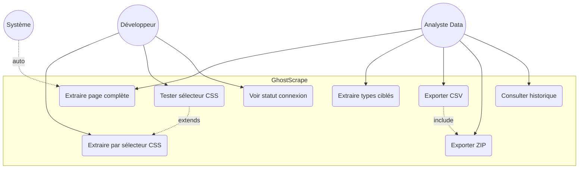

#### 7.1 User Stories

| ID | En tant que... | Je veux... | Afin de... | Priorité |
|---|---|---|---|---|
| US-001 | Analyste | exporter les données extraites en CSV | les ouvrir directement dans Excel | P1 |
| US-002 | Analyste | sélectionner les types de données à extraire | ne récupérer que ce qui m'intéresse | P1 |
| US-003 | Analyste | télécharger les vraies images dans le ZIP | les utiliser dans un rapport | P1 |
| US-004 | Analyste | voir un aperçu des résultats avant export | valider la qualité des données | P1 |
| US-005 | Développeur | tester un sélecteur CSS avant extraction | vérifier qu'il cible les bons éléments | P1 |
| US-006 | Développeur | extraire avec un sélecteur personnalisé | récupérer une structure précise | P1 |
| US-007 | Développeur | obtenir les résultats en JSON | les traiter par script | P2 |
| US-008 | Analyste | extraire automatiquement au changement de page | gagner du temps (pas de clic manuel) | P1 |
| US-009 | Analyste | retrouver mes extractions précédentes | ne pas perdre mon travail | P2 |
| US-010 | Analyste | voir l'état de la connexion à l'extension | savoir si je peux extraire | P1 |
| US-011 | Développeur | voir les attributs HTML complets | déboguer un sélecteur | P2 |
| US-012 | Analyste | que les URLs relatives soient résolues | avoir des URLs cliquables | P1 |
| US-013 | Développeur | forcer une reconnexion de l'extension | résoudre un problème de connexion | P2 |
| US-014 | Analyste | que l'export inclue la date et l'URL source | tracer la provenance des données | P2 |

---

### 8. Fonctionnalités

#### 8.1 Liste des fonctionnalités

| ID | Fonctionnalité | US liées | Priorité | Statut |
|---|---|---|---|---|
| F-001 | Navigation et extraction automatique | US-008 | P1 | ✅ Livré |
| F-002 | Mode Page complète | US-004 | P1 | ✅ Livré |
| F-003 | Mode Extraction ciblée | US-002 | P1 | ✅ Livré |
| F-004 | Mode Sélecteur CSS (avec test) | US-005, US-006, US-011 | P1 | ✅ Livré |
| F-005 | Export CSV avec BOM UTF-8 | US-001 | P1 | ✅ Livré |
| F-006 | Export ZIP textes + liens | US-001 | P1 | ✅ Livré |
| F-007 | Export ZIP images (vrais fichiers) | US-003, US-014 | P1 | ✅ Livré |
| F-008 | Export JSON | US-007 | P2 | 📋 Planifié |
| F-009 | Résolution d'URLs via `document.baseURI` | US-012 | P1 | ✅ Livré |
| F-010 | Détection lazy-load et background CSS | US-004 | P1 | ✅ Livré |
| F-011 | Historique des sessions | US-009 | P2 | ✅ Livré |
| F-012 | Indicateur de connexion extension | US-010 | P1 | ✅ Livré |
| F-013 | Reconnexion automatique (exponential backoff) | US-013 | P1 | ✅ Livré |
| F-014 | Navigation depuis le dashboard | US-008 | P2 | ✅ Livré |

#### 8.2 Détail des fonctionnalités clés

##### F-001 : Navigation et extraction automatique

Le mode `full-page` s'active dès que l'utilisateur navigue vers une URL. Le dashboard envoie `NAVIGATE_TO` → l'extension ouvre un onglet → le content script se déclenche → `GS_READY` est envoyé → `background.js` déclenche automatiquement `TRIGGER_EXTRACTION`.

- **Déclencheur** : activation du mode + arrivée d'un `GS_READY`
- **Délai** : extraction lancée immédiatement (pas d'attente)
- **Options** : `delay` (attente en secondes), `scroll` (défiler la page avant extraction)

##### F-002 à F-004 : Trois modes d'extraction

| Mode | ID | autoExtract | Types de données | Déclencheur |
|---|---|---|---|---|
| Page complète | `full-page` | ✅ Oui | Titres, paragraphes, liens, images | Navigation + activation |
| Extraction ciblée | `data-types` | ❌ Non | Images, titres, liens, paragraphes, listes, tableaux, métadonnées, données structurées | Clic sur "Lancer l'extraction" |
| Sélecteur CSS | `css-selector` | ❌ Non | Contenu des sélecteurs personnalisés | Clic sur "Lancer l'extraction" |

##### F-005 : Export CSV

Génération d'un fichier CSV avec :
- BOM UTF-8 (`\uFEFF`) pour compatibilité Excel
- En-têtes = clés du premier objet
- Virgules échappées par des guillemets
- Guillemets doublés (`""`)
- Objets `JSON.stringify()` dans la cellule
- Images nettoyées : seulement `{ src, alt, width, height }`
- Nom de fichier : `{type}-{date}.csv`

##### F-006 et F-007 : Export ZIP

Structure de l'archive :

```
extraction-exemple.com-2026-07-02.zip
├── metadata.json
├── images/
│   ├── images.json
│   ├── image-001.jpg
│   └── image-002.png
├── headings/
│   ├── h1-001.txt
│   └── h2-001.txt
├── links/
│   ├── links.json
│   └── links.txt
└── paragraphs/
    └── p-001.txt
```

Les images sont téléchargées en base64 via l'extension (fetch depuis le content script) et écrites comme vrais fichiers dans l'archive.

##### F-013 : Reconnexion automatique

| Couche | Délai initial | Délai max | Stratégie |
|---|---|---|---|
| WebSocket frontend (useExtension) | 500 ms | 5 000 ms | Exponentiel + jitter ±50 % |
| Port content ↔ background | 0 ms | 10 000 ms | Array fixe [0, 200, 500, 1k, 2k, 5k, 10k...] |
| WebSocket extension (offscreen) | 200 ms | 5 000 ms | Array fixe [200, 500, 1k, 2k, 3k, 5k] |
| Keepalive service worker | 1 min | 1 min | Alarme Chrome (périodique) |

---

### 9. Critères d'acceptation

#### 9.1 Extraction Full Page (F-002)

| # | Critère | Test |
|---|---|---|
| CA-01 | Les titres H1 à H6 sont récupérés avec leur texte | `expect(result.h1).toContain("...")` |
| CA-02 | Les URLs des liens sont absolues (résolues via baseURI) | `expect(link.resolvedUrl).toMatch(/^https?:\/\//)` |
| CA-03 | Les URLs relatives sont résolues | `resolveUrl("/path") → "https://base.com/path"` |
| CA-04 | Les doublons d'images sont supprimés (même src) | `expect(images).toHaveLength(unique)` |
| CA-05 | Les images lazy-load (`data-src`) sont détectées | `expect(img.src).toBe("https://...")` |
| CA-06 | Les images de fond CSS (`background-image`) sont capturées | `expect(img.type).toBe("background")` |
| CA-07 | `<picture><source srcset>` est supporté | `expect(img.type).toBe("picture")` |
| CA-08 | Les paragraphes vides sont ignorés | `expect(paragraphs).not.toContain("")` |
| CA-09 | La meta description est extraite | `expect(result.metaDescription).not.toBe("")` |

#### 9.2 Extraction ciblée (F-003)

| # | Critère |
|---|---|
| CA-10 | Seuls les types demandés sont présents dans le résultat |
| CA-11 | Les images incluent `src` (résolu), `alt`, `width`, `height`, `type`, `attrs` |
| CA-12 | Les liens incluent `text`, `href`, `resolvedUrl`, `isInternal` |
| CA-13 | Les tableaux incluent `caption`, `headers`, `rows` |
| CA-14 | Les listes incluent `type` (ul/ol) et `items` |
| CA-15 | Les métadonnées incluent `title`, `description`, `og`, `twitter` |
| CA-16 | Les données structurées (JSON-LD) sont parsées |

#### 9.3 Sélecteur CSS (F-004)

| # | Critère |
|---|---|
| CA-17 | Chaque résultat inclut `label`, `selector`, `count`, `items` |
| CA-18 | Chaque item inclut `text`, `html`, `attrs`, `tag`, `href` |
| CA-19 | Les URLs sont résolues dans `resolvedUrl` |
| CA-20 | `isInternal` est calculé correctement |

#### 9.4 Export CSV (F-005)

| # | Critère |
|---|---|
| CA-21 | Le fichier commence par BOM UTF-8 (`\uFEFF`) |
| CA-22 | Les en-têtes correspondent aux clés du premier objet |
| CA-23 | Les virgules dans les valeurs sont entre guillemets |
| CA-24 | Les guillemets dans les valeurs sont doublés |
| CA-25 | Les objets sont `JSON.stringify()` dans la cellule |
| CA-26 | Les valeurs `null` sont converties en chaîne vide |

#### 9.5 Export ZIP (F-006, F-007)

| # | Critère |
|---|---|
| CA-27 | Les dossiers sont organisés par type de données |
| CA-28 | Les métadonnées (URL, date, titre) sont dans `metadata.json` |
| CA-29 | Les images téléchargées sont de vrais fichiers (pas des `.url.txt`) |
| CA-30 | Le nom du ZIP contient le nom de domaine et la date |

#### 9.6 Reconnexion (F-013)

| # | Critère |
|---|---|
| CA-31 | Le délai de reconnexion augmente à chaque tentative |
| CA-32 | Le délai maximum est respecté |
| CA-33 | Le jitter est compris entre 50 % et 150 % du délai de base |
| CA-34 | Les messages sont mis en queue pendant la déconnexion |
| CA-35 | La queue est vidée après reconnexion réussie |

---

### 10. Exigences non fonctionnelles

| ID | Exigence | Description | Mesure |
|---|---|---|---|
| ENF-01 | Disponibilité | Le système fonctionne 100 % en local, sans dépendance externe | Disponibilité = disponibilité de la machine |
| ENF-02 | Performances extraction | Extraction full page (500 éléments) terminée en moins de 2 s | Chronomètre |
| ENF-03 | Performances reconnexion | Reconnexion WebSocket en moins de 5 s (worst case) | Chronomètre |
| ENF-04 | Volume de données | Export ZIP limité à 50 Mo (contrainte mémoire navigateur) | Mesure |
| ENF-05 | Historique | 20 sessions maximum en localStorage, politique FIFO | Compteur |
| ENF-06 | Compatibilité navigateur | Chrome ≥ 116, Edge ≥ 116 | Test manuel |
| ENF-07 | Accessibilité | Interface utilisable sans connaissance en programmation | Test utilisateur |
| ENF-08 | Résilience | Reconnexion automatique de tous les composants en cas de perte de connexion | Test de coupure |

---

## Partie III — Architecture Technique

---

### 11. Architecture globale — C4 Context

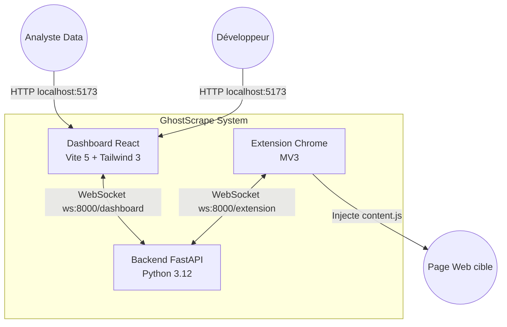

#### 11.1 Interactions

| Interaction | Technologie | Direction | description |
|---|---|---|---|
| Utilisateur → Dashboard | HTTP (localhost:5173) | Unidirectionnel | L'utilisateur interagit avec l'interface React |
| Dashboard → Backend | WebSocket (ws:8000/dashboard) | Bidirectionnel | Envoie les commandes (ACTIVATE_MODE, TRIGGER_EXTRACTION), reçoit les résultats |
| Backend → Extension | WebSocket (ws:8000/extension) | Bidirectionnel | Relaie les commandes du dashboard vers l'extension et inversement |
| Extension → Page web | Injection DOM | Unidirectionnel | Le content script extrait les données du DOM de la page visitée |

#### 11.2 Principe de conception

- **Zéro cloud :** l'utilisateur lance tous les composants sur sa machine
- **Zéro base de données :** le backend est un relais WebSocket stateless, la persistance est côté client (localStorage)
- **Communication exclusivement via WebSocket :** pas d'API REST publique (hors health check)
- **Extension Chrome comme seul moteur d'extraction :** pas de Playwright, pas de Puppeteer (prévu en V0.5)

---

### 12. Architecture technique — Stack et C4 Container

#### 12.1 Stack technique

| Couche | Technologie | Version | Rôle |
|---|---|---|---|
| **Extension** | Chrome MV3 (Manifest V3) | — | Content script + background service worker + offscreen document + popup |
| **Frontend** | React | 18.3.1 | Interface utilisateur (dashboard) |
| **Bundler** | Vite | 5.4.11 | Build et hot-reload en développement |
| **CSS** | Tailwind CSS | 3.4.17 | Styles utilitaires |
| **Backend** | Python / FastAPI | 3.12 / 0.115+ | Relais WebSocket + health check |
| **ZIP** | JSZip | 3.10.1 | Génération d'archives ZIP côté client |
| **Tests frontend** | Vitest | 4.1.9 | Tests unitaires des services et hooks |
| **Tests backend** | pytest | — | Tests du relais WebSocket |
| **Documentation** | Mermaid | — | Diagrammes UML dans le cahier des charges |

#### 12.2 C4 Container — Architecture détaillée

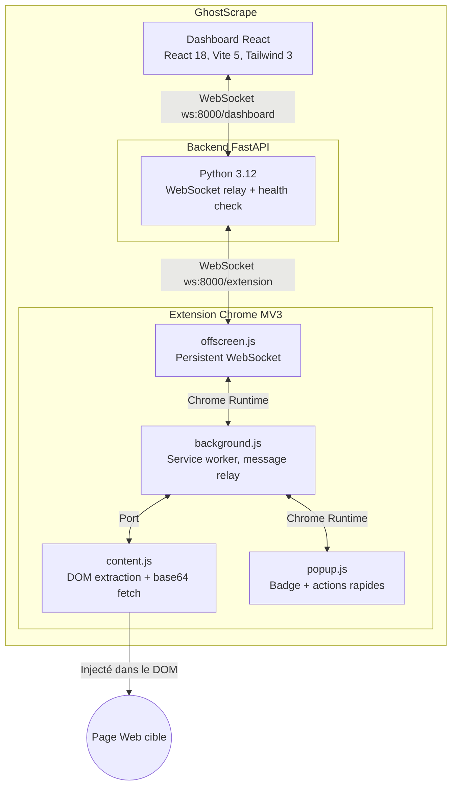

#### 12.3 Description des conteneurs

| Conteneur | Technologie | Responsabilité | Particularité |
|---|---|---|---|
| **content.js** | JavaScript vanilla | Extraction du DOM, résolution d'URLs, fetch d'images en base64, scroll automatique | S'exécute dans le contexte de la page (sandbox MV3) |
| **background.js** | Service Worker MV3 | Relais des messages entre content.js et offscreen.js, keepalive, ouverture d'onglets | Non persistant → alarme chrome.alarms toutes les 1 min |
| **offscreen.js** | Document caché | Connexion WebSocket persistante vers le backend, heartbeat PING/PONG | Nécessaire car un service worker ne peut pas ouvrir de WebSocket |
| **popup.js** | Popup Chrome | Affiche le statut de connexion, badge, actions rapides | Interface minimale (l'essentiel est dans le dashboard) |
| **Backend FastAPI** | Python 3.12 | Relais bidirectionnel extension ↔ dashboard, validation Pydantic, health check | Stateless : ne stocke aucune donnée, ne fait que relayer |
| **Dashboard React** | React 18 + Vite 5 | Interface utilisateur, 3 hooks, 4 panneaux, exports CSV/ZIP, historique | Application monopage (SPA) |

---

### 13. Flux de données et catalogue des messages

#### 13.1 Architecture de connexion

```
Extension (singleton)  ──── WebSocket ────►  Backend FastAPI  ◀──── WebSocket ────  Dashboard(s)
       (1 seule)         ws://localhost           (relais)        ws://localhost     (multiples)
                          :8000/ws/                                   :8000/ws/
                           extension                                   dashboard
```

#### 13.2 Catalogue complet des messages

##### Messages Extension → Dashboard (8 types)

| Type | Direction | Structure | Description |
|---|---|---|---|
| `GS_READY` | Extension → Dashboard | `{ type, url, title }` | Content script chargé et prêt |
| `EXTRACTION_RESULT` | Extension → Dashboard | `{ type, modeId, data }` | Résultats d'extraction |
| `EXTRACTION_ERROR` | Extension → Dashboard | `{ type, modeId, error }` | Erreur lors de l'extraction |
| `IMAGES_BASE64` | Extension → Dashboard | `{ type, images: { filename: base64 } }` | Images encodées en base64 |
| `HTML_STRUCTURE` | Extension → Dashboard | `{ type, html }` | Structure HTML de la page (usage interne) |
| `SELECTOR_TEST_RESULT` | Extension → Dashboard | `{ type, testId, selector, count, preview[] }` | Résultat du test de sélecteur |
| `MODE_ACTIVATED` | Extension → Dashboard | `{ type, modeId }` | Confirmation d'activation de mode |
| `CLOSE_TAB` | Extension → Dashboard | `{ type }` | Onglet fermé par l'utilisateur |

##### Messages Dashboard → Extension (8 types)

| Type | Direction | Structure | Description |
|---|---|---|---|
| `ACTIVATE_MODE` | Dashboard → Extension | `{ type, modeId, capabilities, options }` | Activer un mode d'extraction |
| `DEACTIVATE_MODE` | Dashboard → Extension | `{ type, modeId }` | Désactiver le mode actuel |
| `TRIGGER_EXTRACTION` | Dashboard → Extension | `{ type, modeId, types?, selectors?, options }` | Déclencher l'extraction |
| `DOWNLOAD_IMAGES` | Dashboard → Extension | `{ type, images: [{ src, alt, id }] }` | Demander le téléchargement d'images en base64 |
| `GET_HTML` | Dashboard → Extension | `{ type }` | Demander la structure HTML |
| `TEST_SELECTOR` | Dashboard → Extension | `{ type, selector, testId }` | Tester un sélecteur CSS |
| `NAVIGATE_TO` | Dashboard → Extension | `{ type, url }` | Naviguer vers une URL |
| `FORCE_RECONNECT` | Dashboard → Extension | `{ type }` | Forcer une reconnexion |

##### Messages système Backend → Dashboard (2 types)

| Type | Structure | Déclencheur |
|---|---|---|
| `EXTENSION_CONNECTED` | `{ type }` | Extension connectée au backend WebSocket |
| `EXTENSION_DISCONNECTED` | `{ type }` | Extension déconnectée du backend |

##### Messages système Heartbeat (2 types)

| Type | Direction | Intervalle | Traitement backend |
|---|---|---|---|
| `PING` | Dashboard/Extension → Backend | 15–20 s | Filtré (non relayé), log uniquement |
| `PONG` | Backend → Dashboard/Extension | En réponse | Réponse automatique |

#### 13.3 Diagrammes de séquence

##### Extraction mode Full Page

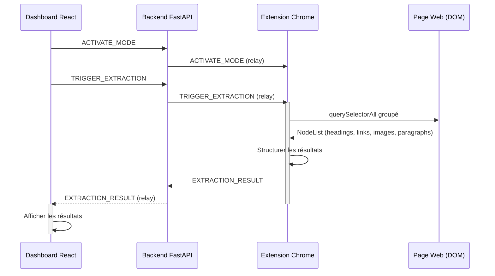

##### Extraction ciblée (Data Types)

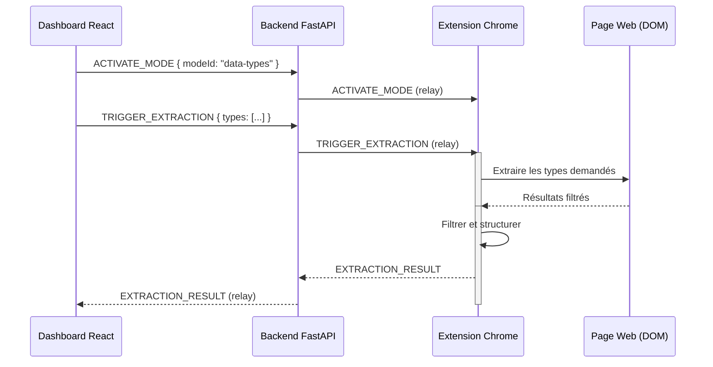

##### Sélecteur CSS avec test

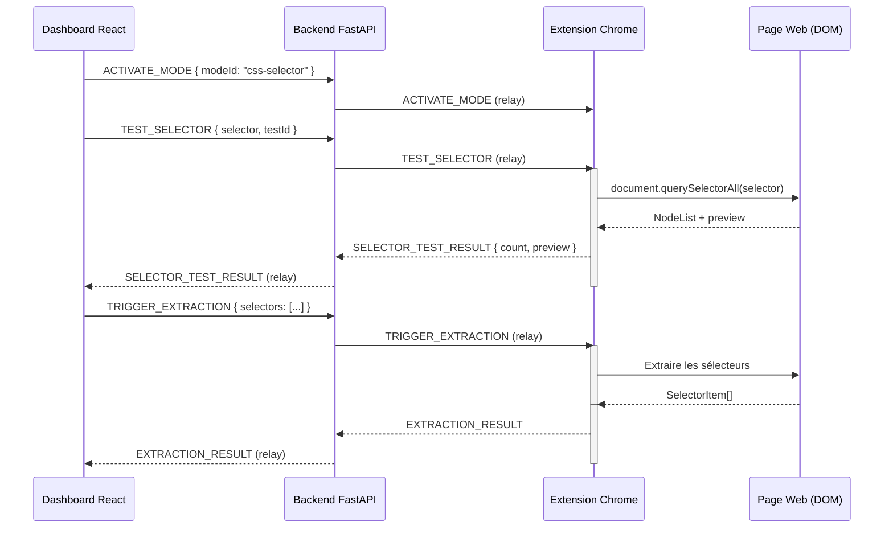

#### 13.4 Diagramme d'activité — Processus d'extraction

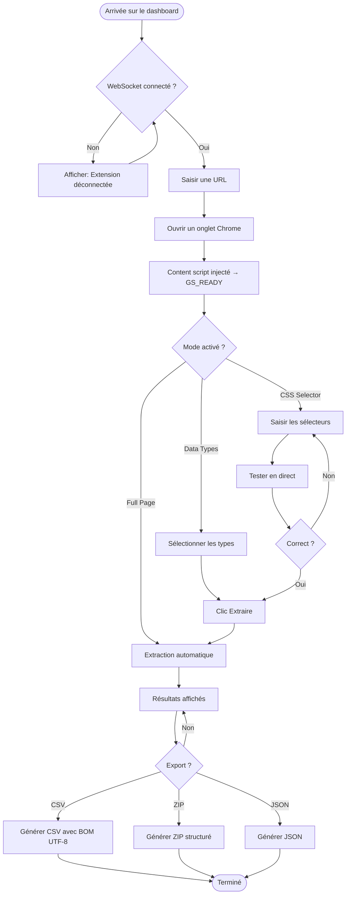

#### 13.5 Algorithme d'extraction (content.js)

1. **Réception** d'un message `TRIGGER_EXTRACTION` via le port Chrome runtime
2. **File d'attente** : l'extraction est chaînée via une promesse série (`extractionQueue`) pour éviter les mutations concurrentes du DOM
3. **Scroll automatique** (si option activée) : défilement progressif en 30 steps avec détection de nouveau contenu, chaque step attend 300 ms
4. **Extraction groupée** : tous les `querySelectorAll` sont exécutés en une seule passe pour minimiser les accès DOM
5. **Résolution d'URLs** : toutes les URLs relatives sont résolues via `document.baseURI`
6. **Détection lazy-load** : vérification des attributs `data-src`, `data-lazy`, `data-original`, analyse des `<picture>` et `srcset`
7. **Images background CSS** : extraction via `background-image: url(...)` dans le style calculé
8. **Post-traitement** : dédoublonnage des images par `src`, suppression des paragraphes vides, structuration des résultats
9. **Envoi** : `EXTRACTION_RESULT` est envoyé au background.js, qui le relaye au dashboard

---

### 14. Modèles de données

#### 14.1 Principes

- **Aucune base de données côté serveur** : le backend est un relais stateless, il ne stocke aucune donnée
- **Validation côté backend** : via Pydantic (message WebSocket)
- **Persistance côté client** : localStorage pour l'historique des sessions, mémoire vive pour les résultats en cours
- **Les modèles ci-dessous** sont les interfaces TypeScript utilisées dans le frontend et l'extension

#### 14.2 Session d'extraction

```typescript
interface ScrapeSession {
  id: string;           // Date.now().toString(36) + random
  modeId: 'full-page' | 'data-types' | 'css-selector';
  url: string;          // URL de la page visitée
  title: string;        // document.title
  timestamp: number;    // Date.now()
  data: object;         // Résultats d'extraction (allégés : sans base64)
}
```

#### 14.3 Image

```typescript
interface ImageResult {
  src: string;               // URL résolue absolue
  alt: string;               // Texte alternatif (ou chaîne vide)
  width: number | null;      // naturalWidth
  height: number | null;     // naturalHeight
  type: 'img' | 'picture' | 'background'; // Origine de l'image
  tag: 'img' | 'source';     // Tag HTML
  html: string;              // outerHTML (max 1000 caractères)
  attrs: Record<string, string>; // Tous les attributs HTML
}
```

#### 14.4 Lien

```typescript
interface LinkResult {
  text: string;              // textContent (trim, max 500)
  html: string;              // innerHTML (trim, max 1000)
  attrs: Record<string, string>;  // Tous les attributs
  tag: string;               // Tag HTML (ex: 'a', 'link')
  href: string;              // Attribut href brut
  resolvedUrl: string | null; // URL absolue résolue
  isInternal: boolean | null; // true si lien interne
}
```

#### 14.5 Titre

```typescript
interface HeadingResult {
  h1: string[];
  h2: string[];
  h3: string[];
  h4: string[];
  h5: string[];
  h6: string[];
}
```

#### 14.6 Tableau

```typescript
interface TableResult {
  caption: string;       // Texte du <caption>
  headers: string[];     // En-têtes de colonnes
  rows: string[][];      // Lignes de données
}
```

#### 14.7 Liste

```typescript
interface ListResult {
  type: 'ul' | 'ol';
  items: string[];       // Textes des <li>
}
```

#### 14.8 Métadonnées

```typescript
interface MetadataResult {
  title: string;
  description: string | null;
  keywords: string | null;
  og: Record<string, string>;      // Propriétés Open Graph
  twitter: Record<string, string>; // Propriétés Twitter Card
}
```

#### 14.9 Données structurées

```typescript
interface StructuredDataItem {
  type: 'json-ld' | 'microdata';
  data?: object;              // JSON-LD parsé
  count?: number;             // Nombre d'éléments microdata
  examples?: Array<{          // Jusqu'à 5 exemples
    type: string;             // itemtype (ex: https://schema.org/Product)
    props: Array<{ name: string; value: string }>;
  }>;
}
```

#### 14.10 Résultat de sélecteur CSS

```typescript
interface SelectorResult {
  label: string;        // Étiquette utilisateur
  selector: string;     // Sélecteur CSS
  count: number;        // Nombre d'éléments matchés
  items: Array<{        // Éléments extraits
    text: string;
    html: string;
    attrs: Record<string, string>;
    tag: string;
    href: string | null;
    resolvedUrl: string | null;
    isInternal: boolean | null;
  }>;
}
```

#### 14.11 Validation Pydantic (backend)

```python
class WSMessage(BaseModel):
    type: str
    class Config:
        extra = "allow"  # Accepte les champs supplémentaires
```

Règles de validation :
1. Doit être du JSON valide
2. Doit avoir un champ `type` non vide
3. `type` ne doit pas être `PING` ou `PONG` (filtrés silencieusement)
4. Les champs supplémentaires sont acceptés (`extra = "allow"`)
5. Les messages invalides sont ignorés (dropped) avec un log

#### 14.12 Diagramme de classes — Relations entre modèles

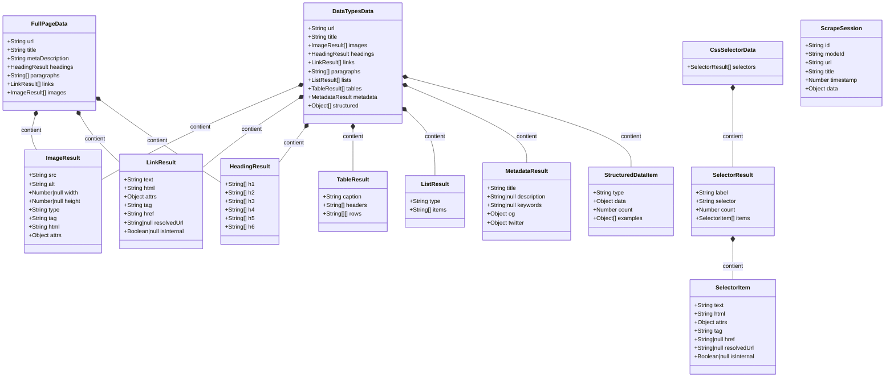

---

### 15. Protocoles et API

#### 15.1 REST

##### `GET /health`

Vérification que le backend est en ligne.

- **Méthode :** `GET`
- **URL :** `http://localhost:8000/health`
- **Réponse :** `{ "status": "ok" }`
- **Code HTTP :** `200 OK`

#### 15.2 WebSocket

##### `WS /ws/extension`

Connexion de l'extension Chrome (singleton).

- **URL :** `ws://localhost:8000/ws/extension`
- **Rôle :** Reçoit les messages de l'extension et les relaye à tous les dashboards connectés
- **État :** Une seule extension à la fois (la précédente est déconnectée silencieusement)

##### `WS /ws/dashboard`

Connexion du dashboard React (multi-connexion).

- **URL :** `ws://localhost:8000/ws/dashboard`
- **Rôle :** Reçoit les messages des dashboards et les relaye à l'extension
- **État :** Plusieurs dashboards peuvent être connectés simultanément

#### 15.3 Heartbeat

| Client | Intervalle | Message |
|---|---|---|
| Dashboard (useExtension.js) | 20 s | `{ type: "PING" }` |
| Extension (offscreen.js) | 15 s | `{ type: "PING" }` |

Les messages `PING` et `PONG` sont filtrés par le backend (ne sont pas relayés).

#### 15.4 Gestion des reconnexions

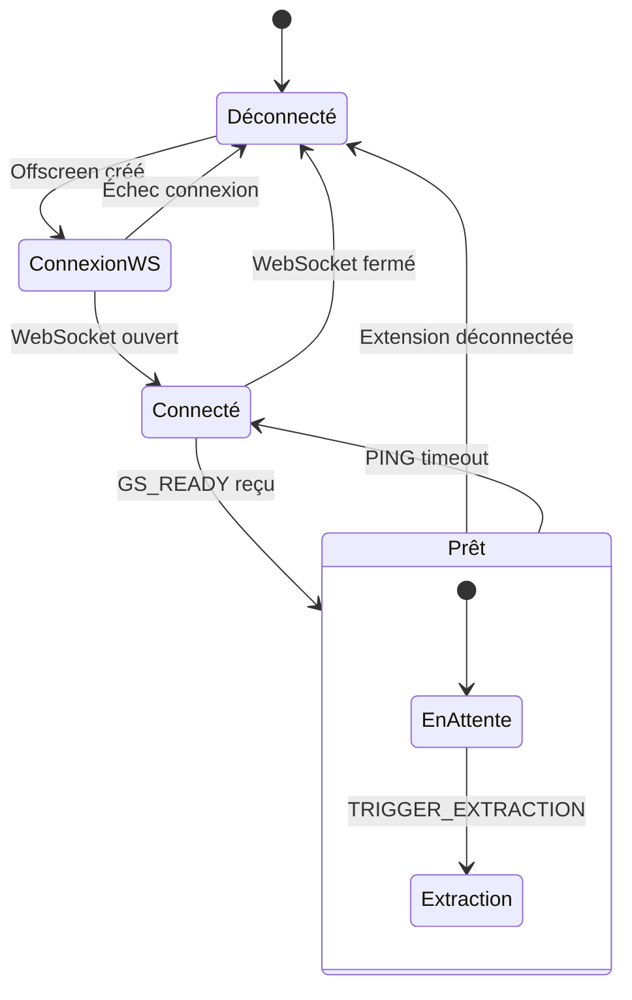

| Couche | Déclencheur | Action |
|---|---|---|
| WebSocket Dashboard | `onclose` | Exponential backoff 500ms → 5s, jitter ±50 % |
| WebSocket Extension (offscreen) | `onclose` | Array fixe [200, 500, 1k, 2k, 3k, 5k] ms |
| Port content.js ↔ background.js | `onDisconnect` | Array fixe [0, 200, 500, 1k, 2k, 5k, 10k] ms |
| Service worker Chrome | Alarme 1 min | `ensureOffscreen()` périodique |

#### 15.5 Diagramme d'état — Cycle d'extraction

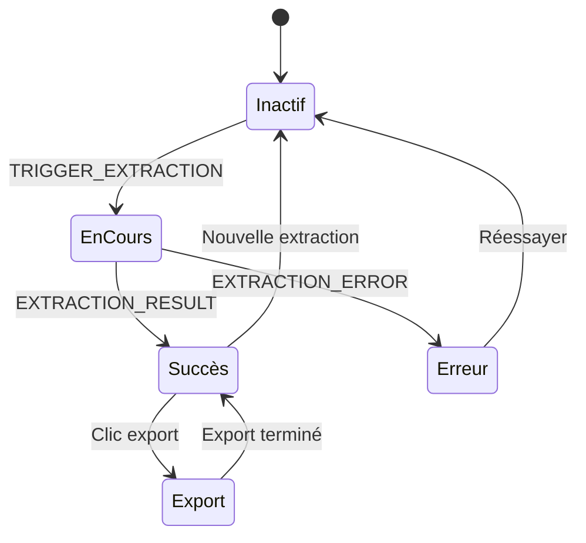

---

### 16. Gestion d'état et persistance

#### 16.1 Architecture stateless

GhostScrape suit une **architecture stateless côté backend** :

| Composant | État | Persistance |
|---|---|---|
| Backend FastAPI | Aucun (relais uniquement) | Volatile (mémoire) |
| Extension Chrome | Connexion WebSocket, file d'attente d'extraction | Volatile (durée de vie de l'extension) |
| Dashboard React | Résultats d'extraction en cours, connexion WebSocket | Volatile (mémoire vive) |
| Historique des sessions | Sessions sauvegardées | localStorage (20 max, FIFO) |

#### 16.2 Justification

L'absence de base de données est un **choix délibéré** :

1. **Simplicité** : pas d'installation de PostgreSQL, Redis ou autre service
2. **Confidentialité** : aucune donnée persistée côté serveur = zéro risque de fuite
3. **Performance** : pas de latence réseau pour des requêtes DB
4. **Déploiement** : le backend se lance en une commande (`uvicorn`), aucune configuration requise
5. **Évolutivité** : si une persistance devient nécessaire (utilisateurs, authentification), une migration vers une base de données est possible sans refonte architecturale

#### 16.3 Cycle de vie des données

```
Dashboard React (résultats en mémoire)
    │
    ├── Export CSV → fichier téléchargé (disque utilisateur)
    ├── Export ZIP → fichier téléchargé (disque utilisateur)
    └── Historique → localStorage (20 sessions max)
                        │
                        └── FIFO : suppression des plus anciennes
```

#### 16.4 Gestion de la mémoire

- Les images en base64 sont conservées en mémoire uniquement le temps du téléchargement
- Le `stripImages()` retire les champs `imageBlobs` des sessions historisées
- Les URLs d'objets (`createObjectURL`) sont révoquées après 10 s

---

## Partie IV — Exigences Transverses et Qualité

---

### 17. Sécurité

#### 17.1 Principes fondamentaux

- **Zéro donnée externe** : aucune donnée extraite ne quitte la machine de l'utilisateur
- **Zéro exécution de code utilisateur** : les sélecteurs CSS sont des chaînes, jamais exécutés comme code
- **Zéro téléchargement automatique** : l'utilisateur clique toujours pour télécharger
- **Sandbox MV3** : le content script est isolé de la page par Chrome

#### 17.2 CORS

```python
app.add_middleware(
    CORSMiddleware,
    allow_origins=["http://localhost:3000", "http://127.0.0.1:3000"],
    allow_credentials=True,
    allow_methods=["*"],
    allow_headers=["*"],
)
```

- Origines explicitement listées (pas de `["*"]` avec `credentials=True`)
- Seulement les ports de développement

#### 17.3 Données sensibles

- Aucun mot de passe stocké
- Aucun token, clé API, ou secret
- Aucune persistance backend (tout est in-memory ou localStorage)
- Aucune communication TLS en développement (localhost uniquement)

#### 17.4 Permissions extension MV3

```json
{
  "permissions": [
    "offscreen",
    "alarms",
    "storage"
  ],
  "host_permissions": [
    "http://localhost:8000/*",
    "https://*/*",
    "http://*/*"
  ]
}
```

- `offscreen` : nécessaire pour le WebSocket persistant
- `alarms` : keepalive du service worker
- `storage` : stockage local (configuration)
- `host_permissions` : injection du content script sur toutes les pages (l'utilisateur choisit où extraire)

---

### 18. Gestion des erreurs

#### 18.1 Codes d'erreur

| Code | Signification | Cause | Action recommandée |
|---|---|---|---|
| GS001 | Extension absente | WebSocket déconnecté, extension non chargée | Attendre la reconnexion automatique |
| GS002 | Timeout extraction | Page trop lourde, sélecteur trop large | Réessayer ou réduire le périmètre |
| GS003 | WebSocket fermé | Backend arrêté ou réseau coupé | Relancer le backend |
| GS004 | Sélecteur invalide | CSS mal formé, sélecteur inexistant | Corriger le sélecteur et réessayer |
| GS005 | Image inaccessible | CORS bloque le fetch, URL 404, timeout | Ignorée silencieusement |
| GS006 | localStorage saturé | Quota dépassé (5–10 Mo) | Supprimer l'historique |
| GS007 | Échec téléchargement | API File System Access non disponible | Fallback download automatique |

#### 18.2 Journalisation

Les logs utilisent le préfixe `[GS]` (GhostScrape) avec des suffixes par module :

| Préfixe | Module | Exemple |
|---|---|---|
| `[GS]` | content.js | `[GS] content script loaded - inline mode` |
| `[GS BG]` | background.js | `[GS BG] Mode activated: full-page` |
| `[GS Offscreen]` | offscreen.js | `[GS Offscreen] WS connected` |
| `[WS]` | backend endpoint_ws.py | `[WS] Extension connected` |

Niveaux informels :

| Niveau | Utilisation |
|---|---|
| `console.log()` | Informations générales, flux normal |
| `console.warn()` | Problème non bloquant (ex: échec fetch image) |
| `console.error()` | Erreur bloquante (ex: échec d'initialisation) |

#### 18.3 Gestion des erreurs par composant

| Composant | Erreur | Comportement |
|---|---|---|
| WebSocket dashboard | JSON invalide | Ignoré silencieusement |
| WebSocket extension | Message sans `type` | Ignoré avec log |
| content.js | Échec extraction | `EXTRACTION_ERROR` envoyé au dashboard |
| content.js | Fetch image échoué | `console.warn` et skip (continue les autres) |
| Extension | Port déconnecté | Reconnexion automatique (backoff) |
| Frontend | localStorage corrompu | Ignoré (retourne tableau vide) |
| Frontend | File picker refusé | Fallback download (élément `<a>`) |
| Frontend | WebSocket fermé | Reconnexion avec exponential backoff |
| Service worker | Offscreen tué | Recréé via alarme keepalide |

---

### 19. Interface et maquettes

#### 19.1 Dashboard principal (mode sélecteur CSS actif)

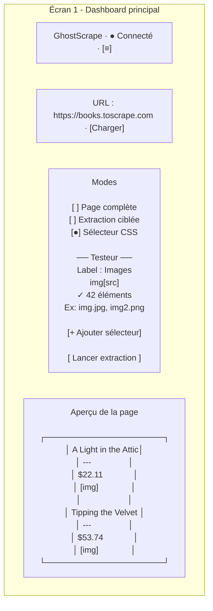

#### 19.2 Résultats d'extraction (mode page complète)

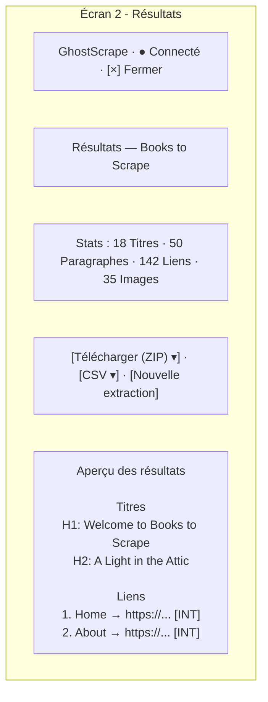

#### 19.3 Extraction ciblée

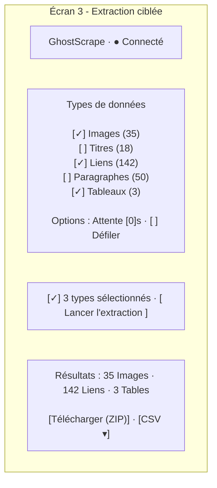

---

### 20. Contraintes techniques et versions

#### 20.1 Contraintes techniques

| Contrainte | Détail |
|---|---|
| Manifest V3 | Pas de `eval()`, pas de `Function()`, pas de script distant |
| Offscreen API | Chrome ≥ 116, document caché pour WebSocket |
| WebSocket | Pas de `WebSocket` dans un service worker → offscreen obligatoire |
| Content script | Isolé du contexte de la page (sandbox MV3) |
| CORS | Les `fetch()` depuis content.js sont soumis aux CORS de la page |
| localStorage | Limité à ~5–10 Mo selon le navigateur |
| Service worker | Tué après ~30 s d'inactivité → keepalive nécessaire |
| Port Chrome | 1 seule connexion par port de message runtime |

#### 20.2 Compatibilité navigateur

| Navigateur | Support | Raison |
|---|---|---|
| Google Chrome ≥ 116 | ✅ Complet | MV3, Offscreen API |
| Microsoft Edge ≥ 116 | ✅ Complet | Basé sur Chromium |
| Firefox | ❌ Non | MV3 non supporté |
| Safari | ❌ Non | Pas de MV3 |

#### 20.3 Versions des composants

| Composant | Version actuelle | Prochaine version |
|---|---|---|
| Extension Chrome | 0.3.0 | 0.4.0 |
| Frontend React | 0.1.0 | 0.2.0 |
| Backend FastAPI | 0.2.0 | 0.3.0 |

---

## Partie V — Cycle de Vie et Déploiement

---

### 21. Performances attendues

#### 21.1 Objectifs mesurés

| Métrique | Valeur mesurée (code) | Objectif |
|---|---|---|
| Extraction full page (500 éléments) | — | < 2 s |
| Taille maximale du ZIP | — | 50 Mo (mémoire navigateur) |
| Reconnexion WebSocket (worst case) | 5 000 ms (max backoff) | < 5 s |
| Ping keepalive | 15–20 s (dashboard), 15 s (extension) | < 25 s |
| Temps d'affichage des résultats | — | < 500 ms après réception |
| Extraction en concurrence | 1 seule à la fois (queue FIFO série) | 1 |
| Historique localStorage | 20 sessions max | 20 |

#### 21.2 Algorithme de scroll

Le scroll automatique s'effectue en **30 steps** avec une attente de **300 ms** entre chaque step :

- Durée totale d'un scroll complet : `30 × 300ms = 9 s`
- Après chaque step, détection de nouveau contenu via `MutationObserver` ou `requestAnimationFrame`
- Le scroll est intégré dans la file d'attente d'extraction (pas de concurrence)

#### 21.3 Timeouts

| Contexte | Timeout | Action |
|---|---|---|
| Fetch image (extension) | Aucun (abort implicite) | `console.warn` et skip |
| Extraction | Aucun (attente que la queue se vide) | Peut bloquer si page infinie |
| WebSocket | Aucun (keepalive détecte la coupure) | Reconnexion |

---

### 22. Stratégie de tests

#### 22.1 Tests automatisés

| Suite | Outil | Emplacement | Tests |
|---|---|---|---|
| Frontend — Services | Vitest | `frontend/src/__tests__/downloadCsv.test.js` | 6 tests |
| Frontend — Routing | Vitest | `frontend/src/__tests__/messageRouter.test.js` | 8 tests |
| Frontend — Registry | Vitest | `frontend/src/__tests__/modeRegistry.test.js` | 6 tests |
| Backend — WebSocket | pytest | `backend/tests/test_websocket.py` | 6 tests |
| Extension — URLs | HTML manuel | `extension/test/resolveUrl.test.html` | 8 cas |
| Extension — Images | HTML manuel | `extension/test/extractImages.test.html` | 6 cas |

**Total :** 26 tests automatisés + 8 cas manuels = 34 tests

#### 22.2 Exécution

```bash
# Tests frontend
cd frontend && npx vitest run

# Tests backend
cd backend && python -m pytest -v

# Tests extension (manuel)
# Ouvrir extension/test/resolveUrl.test.html dans Chrome
# Ouvrir extension/test/extractImages.test.html dans Chrome
```

#### 22.3 Couverture visée

| Type | Cible |
|---|---|
| Services (download*.js, messageRouter.js) | > 80 % |
| Hooks (useExtension, useModeEngine, useSessionHistory) | > 60 % |
| Composants panels | > 50 % |

#### 22.4 Test manuel de l'extension

Deux pages HTML de test permettent de valider manuellement le comportement de l'extension sans backend :

| Fichier | Test |
|---|---|
| `extension/test/resolveUrl.test.html` | Résolution d'URLs : relative, absolue, base, ancre |
| `extension/test/extractImages.test.html` | Extraction d'images : img, picture, lazy-load, background CSS |

---

### 23. Déploiement

#### 23.1 Installation locale

```bash
# 1. Cloner le dépôt
git clone https://github.com/anomalyco/ghostscrape.git
cd ghostscrape

# 2. Lancer le backend
cd backend
python -m venv venv
venv\Scripts\activate  # Windows
pip install -r requirements.txt
uvicorn app.main:app --reload --port 8000

# 3. Lancer le frontend (nouveau terminal)
cd frontend
npm install
npm run dev

# 4. Charger l'extension
# chrome://extensions → Mode développeur → Charger l'extension non empaquetée
# Sélectionner le dossier extension/
```

#### 23.2 Architecture de déploiement

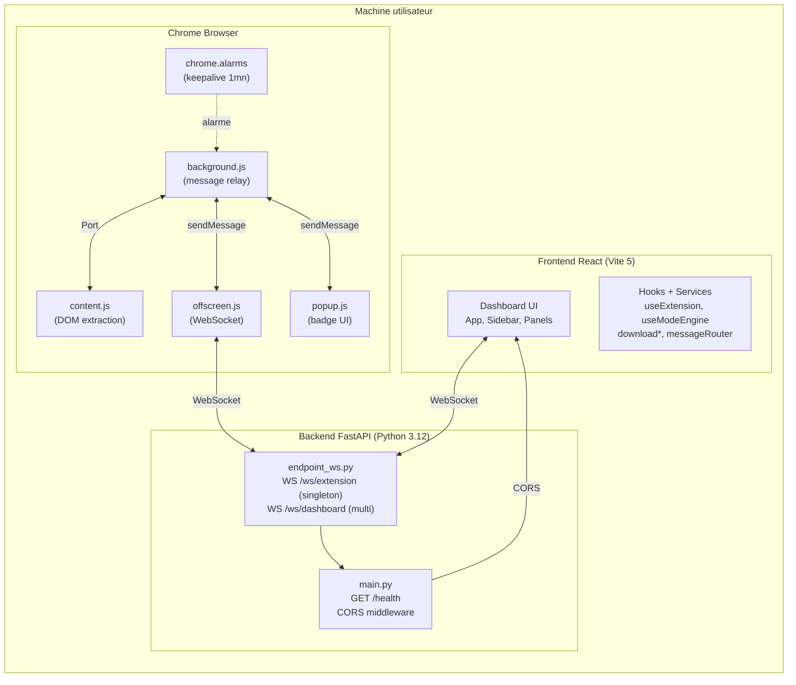

#### 23.3 Configuration réseau

- Backend : `http://localhost:8000`
- Frontend : `http://localhost:5173` (dev) ou `http://localhost:3000` (prod)
- Extension : se connecte à `ws://localhost:8000/ws/extension`

---

### 24. Maintenance et évolutions

#### 24.1 Cycle de maintenance

| Niveau | Fréquence | Actions |
|---|---|---|
| Corrective | Continue | Issues GitHub, PRs de correction |
| Évolutive | Par version (V0.4, V0.5, V0.6) | Nouvelles fonctionnalités planifiées |
| Préventive | Mensuelle | Test de compatibilité Chrome, mise à jour des dépendances |

#### 24.2 Gestion des versions

Les versions suivent le format `vX.Y.Z` :

- **X** (majeur) : changement architectural ou rupture de compatibilité
- **Y** (mineur) : nouvelle fonctionnalité
- **Z** (patch) : correction de bug

Les versions sont taguées dans le dépôt GitHub.

#### 24.3 Procédure de mise à jour

```bash
# Récupérer la dernière version
git pull origin main

# Mettre à jour les dépendances
cd frontend && npm install
cd ../backend && pip install -r requirements.txt --upgrade

# Recharger l'extension
# chrome://extensions → ⌘R (mettre à jour)
```

#### 24.4 Dépendances externes

| Dépendance | Risque | Mesure |
|---|---|---|
| Chrome MV3 (offscreen API) | Google modifie ou supprime l'API | Surveiller ChromeStatus, planifier migration Playwright (V0.5) |
| React 18 | Fin de support | Migration vers React 19 (LTS suivante) |
| FastAPI / Pydantic | Breaking changes | Tests automatisés, CI GitHub |
| JSZip | Vulnérabilité | Mise à jour via `npm audit` |

---

## Partie VI — Pilotage et Risques

---

### 25. Roadmap

#### 25.1 Planning général

| Phase | Version | Contenu | Statut |
|---|---|---|---|
| V0.1 — MVP | 0.1.0 | 3 modes d'extraction, export CSV, export ZIP textes + liens, WebSocket relay, dashboard React, extension MV3 | ✅ Livré |
| V0.2 — Images | 0.2.0 | Téléchargement réel des images dans le ZIP (base64 fetch), test sélecteurs, barre de navigation, historique localStorage | ✅ Livré |
| V0.3 — UX | 0.3.0 | Gestion des erreurs utilisateur, skeletons, mode sombre, responsive, indicateur de connexion, queue FIFO d'extraction | ✅ Livré |
| V0.4 — Performance | 0.4.0 | Virtualisation des longues listes, cache des extractions, export JSON, annulation d'extraction, pagination des résultats | 📋 Planifié |
| V0.5 — Headless | 0.5.0 | Mode Playwright pour automatisation multi-page, scraping sans interface utilisateur | 📋 Planifié |
| V0.6 — Multi-browser | 0.6.0 | Portage Firefox, support Edge natif, extraction récursive (liens internes), support iframes | 📋 Planifié |

#### 25.2 Fonctionnalités planifiées (backlog)

| Fonctionnalité | Version cible | Priorité |
|---|---|---|
| Export JSON | V0.4 | P2 |
| Pagination / lazy loading des résultats | V0.4 | P2 |
| Annulation d'une extraction en cours | V0.4 | P2 |
| Mode comparaison (2 pages côte à côte) | V0.5 | P3 |
| Export PDF des résultats | V0.5 | P3 |
| Extraction récursive (liens internes) | V0.6 | P3 |
| Support des iframes | V0.6 | P3 |

#### 25.3 Dépendances entre versions

```
V0.1 ──→ V0.2 ──→ V0.3 ──→ V0.4 ──→ V0.5 ──→ V0.6
MVP       Images    UX         Perf      Headless  Multi-browser
          (base64)  (robustesse) (cache)   (Playwright) (Firefox)
```

---

### 26. Risques et atténuation

#### 26.1 Matrice des risques

| ID | Risque | Probabilité | Impact | Niveau | Atténuation |
|---|---|---|---|---|---|
| R-01 | Google modifie les APIs MV3 (offscreen, service worker) | Forte | Élevé | **Critique** | Surveiller les annonces Chrome, prévoir migration Playwright (V0.5) |
| R-02 | Le site cible bloque le scraping (CORS, CSP, bot detection) | Élevée | Moyen | **Élevé** | Fallback Playwright en V0.5 ; les sélecteurs CSS contournent CSP |
| R-03 | Le DOM du site cible change (classes, structure) | Très élevée | Moyen | **Élevé** | Sélecteurs CSS personnalisés permettent de s'adapter sans mise à jour |
| R-04 | La connexion WebSocket est instable | Moyenne | Faible | **Faible** | Reconnexion automatique avec backoff + queue de messages |
| R-05 | Les images ne sont pas accessibles (CORS, 403) | Élevée | Faible | **Moyen** | Échec silencieux + fallback dans le ZIP |
| R-06 | Le quota localStorage est dépassé | Faible | Faible | **Faible** | Nettoyage FIFO (max 20 sessions), `stripImages()` retire les données lourdes |
| R-07 | Le service worker Chrome est tué par le navigateur | Moyenne | Moyen | **Moyen** | Keepalive via `chrome.alarms`, `ensureOffscreen()` périodique |
| R-08 | Une page très lourde fait planter le content script | Faible | Élevé | **Élevé** | Queue FIFO, timeout extraction, possibilité d'arrêt manuel (V0.4) |

#### 26.2 Stratégies de mitigation

- **R-01 / R-07** : Tests d'acceptance automatisés sur les APIs Chrome, suivi des ChromeStatus
- **R-02 / R-03** : Architecture flexible permettant d'ajouter un moteur headless sans refonte
- **R-04** : Logs de reconnexion pour identifier les patterns d'instabilité
- **R-05** : Monitoring du ratio échecs/succès des fetch images
- **R-06** : Alerte utilisateur avant suppression automatique des sessions
- **R-08** : Extraction par lots (pagination) en V0.4

#### 26.3 Budget

| Poste | Coût |
|---|---|
| Infrastructure cloud | 0 € (100 % local) |
| Licence logicielle | 0 € (open source) |
| Développement | Interne |
| Maintenance | Communauté GitHub (issues, PRs) |
| **Total utilisateur** | **0 €** |

---

## Partie VII — Annexes

---

### 27. Glossaire

| Terme | Définition |
|---|---|
| **Background (service worker)** | Script Chrome MV3 non persistant qui gère les événements de l'extension |
| **Backend** | Serveur Python FastAPI qui relaie les messages WebSocket |
| **Content script** | Script injecté dans la page web visitée, peut accéder au DOM |
| **CORS** | Cross-Origin Resource Sharing — politique de sécurité des navigateurs |
| **CSV** | Comma-Separated Values — format tabulaire ouvert dans Excel |
| **Dashboard** | Interface React de GhostScrape, affiche les résultats |
| **DOM** | Document Object Model — structure HTML de la page |
| **Extension** | Composant Chrome MV3 qui extrait les données du DOM |
| **FIFO** | First In, First Out — stratégie de file d'attente |
| **Figma** | (non utilisé) — outil de design d'interface |
| **Heartbeat** | Message PING/PONG pour maintenir la connexion WebSocket active |
| **Jitter** | Variation aléatoire appliquée aux délais de reconnexion |
| **JSZip** | Bibliothèque JavaScript de génération de ZIP côté client |
| **lazy-load** | Technique de chargement différé des images (attributs data-src) |
| **localStorage** | Stockage persistant côté navigateur (~5–10 Mo) |
| **MV3** | Manifest V3 — dernier format d'extension Chrome |
| **Offscreen document** | Page HTML cachée utilisée par l'extension pour les WebSockets persistants |
| **Pydantic** | Bibliothèque Python de validation de données |
| **SaaS** | Software as a Service — logiciel payant hébergé dans le cloud |
| **Sandbox MV3** | Environnement isolé du content script par rapport à la page visitée |
| **SPA** | Single Page Application — application web dynamique (React, Vue, Angular) |
| **Stateless** | Architecture sans état persistant côté serveur |
| **WebSocket** | Protocole de communication bidirectionnelle temps réel |
| **ZIP** | Format d'archive contenant fichiers et dossiers |

---

### 28. Architecture Decision Records (ADR)

#### ADR-001 — Pourquoi WebSocket plutôt que REST ?

**Statut :** Accepté — 2025-11-01

**Contexte :** Le dashboard a besoin de connaître en temps réel l'état de l'extension (connectée/déconnectée) et de recevoir les résultats d'extraction sans polling.

**Décision :** Utiliser WebSocket (FastAPI) pour toutes les communications.

**Conséquences :**
- ✅ Temps réel : messages push dès qu'un événement se produit
- ✅ Une seule connexion bidirectionnelle
- ✅ FastAPI supporte nativement les WebSockets (pas de lib externe)
- ❌ Backend stateful (doit gérer les connexions en mémoire)
- ❌ Reconnexion et heartbeat à implémenter manuellement

**Alternatives rejetées :**

| Solution | Raison du rejet |
|---|---|
| SSE (Server-Sent Events) | Unidirectionnel (serveur → client seulement) |
| Polling HTTP (toutes les 500 ms) | Latence, overhead réseau, dégradé |
| gRPC | Trop lourd pour une app locale, pas natif dans le navigateur |

---

#### ADR-002 — Pourquoi React 18 plutôt qu'un autre framework ?

**Statut :** Accepté — 2025-11-01

**Contexte :** Le dashboard doit gérer des interfaces réactives avec des états partagés (connexion WebSocket, données d'extraction, historique).

**Décision :** React 18 avec Vite 5 et Tailwind 3.

**Conséquences :**
- ✅ Hooks pour la gestion d'état simple (`useState`, `useEffect`)
- ✅ Vite : HMR ultra-rapide en développement
- ✅ Tailwind : pas de fichier CSS séparé, styles utilitaires
- ❌ Bundle plus lourd que Svelte ou Solid (mais négligeable pour un dashboard)

**Alternatives rejetées :**

| Solution | Raison du rejet |
|---|---|
| Vue 3 | Moins d'écosystème, moins de librairies |
| Svelte | Plus récent, moins de ressources communautaires |
| Solid.js | Très performant mais niche |
| Vanilla JS | Non maintenable pour une UI complexe |

---

#### ADR-003 — Pourquoi FastAPI plutôt que Django ou Flask ?

**Statut :** Accepté — 2025-11-01

**Contexte :** Le backend doit gérer des WebSockets et des requêtes HTTP simples.

**Décision :** FastAPI (Python 3.12).

**Conséquences :**
- ✅ WebSocket natif (pas de lib supplémentaire)
- ✅ Pydantic pour la validation des messages
- ✅ Async/await natif
- ✅ Auto-documentation OpenAPI
- ❌ Pas d'ORM intégré (mais pas nécessaire : pas de base de données)

**Alternatives rejetées :**

| Solution | Raison du rejet |
|---|---|
| Django + Channels | Lourd pour un simple relais WebSocket |
| Flask + flask-socketio | WebSocket artisanal, synchrone par défaut |
| Node.js (Express + ws) | Changement de langage |

---

#### ADR-004 — Pourquoi Manifest V3 plutôt que V2 ?

**Statut :** Accepté — 2025-11-01, mis à jour 2026-01-15

**Contexte :** Chrome a commencé à bloquer les extensions MV2 en 2024 et les a complètement désactivées en 2025.

**Décision :** MV3 avec service worker + offscreen document.

**Conséquences :**
- ✅ Compatible avec les versions récentes de Chrome
- ✅ Plus sécurisé (sandbox, permissions minimales)
- ❌ Service worker non persistant → offscreen document obligatoire pour WebSocket
- ❌ Alarme keepalive nécessaire (1 min)
- ❌ Pas de `chrome.runtime.connect()` depuis un service worker vers un content script

**Alternatives rejetées :**

| Solution | Raison du rejet |
|---|---|
| MV2 | Bloqué par Chrome, obsolète |
| Playwright autonome (sans extension) | Prévu en V0.5, mais ne remplace pas l'interaction temps réel |

---

#### ADR-005 — Pourquoi JSZip plutôt que CompressionStream ?

**Statut :** Accepté — 2025-11-01

**Contexte :** Le frontend doit générer des archives ZIP côté client pour l'export.

**Décision :** JSZip (bibliothèque JavaScript).

**Conséquences :**
- ✅ Compatible avec tous les navigateurs (pas d'API récente)
- ✅ API simple : `new JSZip()`, `zip.file()`, `zip.generateAsync()`
- ✅ Gère les fichiers en base64 directement
- ❌ +88 Ko dans le bundle (minifié)

**Alternatives rejetées :**

| Solution | Raison du rejet |
|---|---|
| CompressionStream API | Chrome ≥ 105 seulement, API plus complexe |
| Génération côté backend | Nécessite d'envoyer les données au serveur (contredit le principe 0-cloud) |
| zip.js | Alternative valide, moins connue, même poids |

---

#### ADR-006 — Pourquoi File System Access API avec fallback download ?

**Statut :** Accepté — 2026-01-15

**Contexte :** Le téléchargement de fichiers (CSV, ZIP) doit fonctionner dans tous les navigateurs Chromium, avec une expérience utilisateur optimale.

**Décision :** Utiliser l'API File System Access (`showSaveFilePicker`) avec fallback automatique vers le téléchargement classique (élément `<a>` + `click()`).

**Conséquences :**
- ✅ Expérience utilisateur : boîte de dialogue "Enregistrer sous" native
- ✅ Fallback transparent si l'API n'est pas disponible
- ❌ `showSaveFilePicker` nécessite un contexte sécurisé (HTTPS ou localhost)
- ❌ Pas de support Firefox / Safari (fallback utilisé)

**Alternatives rejetées :**

| Solution | Raison du rejet |
|---|---|
| Téléchargement forcé (Blob + URL) | Pas de choix de l'emplacement par l'utilisateur |
| Envoi au backend pour téléchargement | Contredit le principe 0-cloud |

---

> **Fin du document — Cahier des Charges GhostScrape v1.0**
